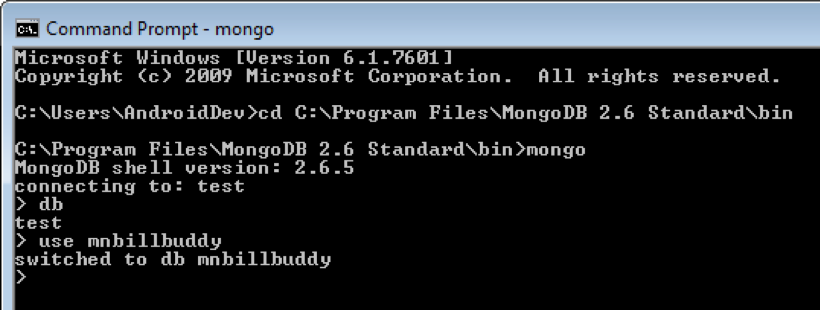

# xap-dev-training - lab1-guide

## 1	Introduction

#### 1.1 setup

##### 1.1.1 Download java 1.8 and define JAVA_HOME.

##### 1.1.2 Download the latest XAP Commercial Edition and extract it on your machine:

    cd ~/Downloads
    wget http://gigaspaces-releases-eu.s3.amazonaws.com/xap/14.5.0/gigaspaces-xap-enterprise-14.5.0.zip
    unzip gigaspaces-xap gigaspaces-xap-enterprise-14.5.0.zip
    
##### 1.1.3 Define your XAP_HOME directory: 
###### Linux - add a new line in bash profile.
    vi ~/.bash_profile
    export XAP_HOME=/Users/yuval/Downloads/gigaspaces-xap-enterprise-14.5.0
###### Windows - add XAP_HOME to your system variables
  
##### 1.1.4 Add relevant license to `xap-license.txt` file located at the root of xap insllation directory.
##### 1.1.5 Download IntelliJ IDEA Community:
   https://www.jetbrains.com/idea/download
##### 1.1.6 Go to `$XAP_HOME/bin` open `setenv-overrides.sh` and set:  
   `JAVA_HOME` -> point to you java installation directory  
   `XAP_LOOKUP_GROUPS` -> set any unique identifier
   
##### 1.1.7 Test your XAP Installation.  
   You will start a XAP process (gs-agent) and you will wait to see a message that the gs-agent started successfully with your XAP_LOOKUP_GROUPS.               
        
        cd ${XAP_HOME}/bin 
        ./gs-agent.sh
   
   The following screen will appear:
   (Search for the message marked below):
   

   
   If you see the above, you have successfully installed the courseware for our class.
   
##### 1.1.8	Stop processes
    Stop the gs-agent process

#### 1.2	Wiki and API Doc Exercise  

##### 1.2.1 Validate internet connectivity by opening a browser and going to GigaSpace site: 
        www.gigaspaces.com
##### 1.2.2 Click on support-> Documents

       

     
   
   
