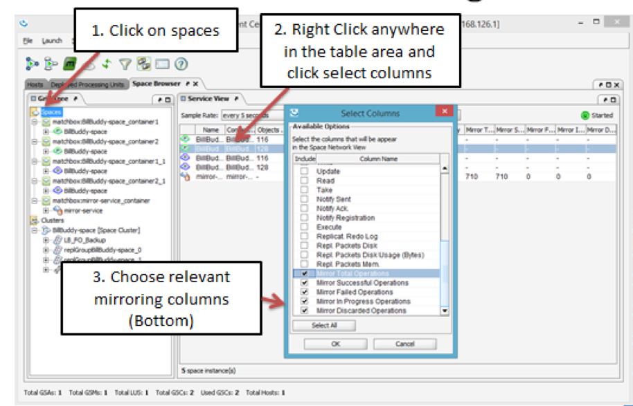

# lab6-solution - NOSQL Space Document Persistency 

## Lab Goals

Implement and configure persistency for Space Document using Mongo DB.  

## Lab Description
1. During this lab you will deploy Bill Buddy Application & examine Mongo DB database to examine that space document (Contract) are being persistent.  
2. After Persisting you will test initial load to validate those persistent Space Documents are upload into the space during space deployment in the initial load process.    

## Lab setup
In our Lab we will install Mongo DB and use the console to create DB and query information.  
	
Make sure you restart gs-agent and gs-ui (or at least undeploy all Processing Units using gs-ui)
    
## 6.1	Clone and build the project lab

6.1.1 Create lab directory

    mkdir ~/XAPPersistTraining/labs/lab6-solution
      
6.1.2 Clone the project from git
    
    cd ~/XAPPersistTraining/labs/lab6-solution
    git clone https://github.com/GigaSpaces-ProfessionalServices/xap-persist-training.git 
    
6.1.3 Checkout lab6-solution
    
    cd xap-persist-training
    git checkout lab6-solution
    
6.1.4 Verify that the branch has been checked out.
    
    git branch
    * lab6-solution
      master 
    
6.1.5 Open xap-persist-training project with intellij  

#### Notice the following 5 modules in Intellij: ####

##### BillBuddy-Space #####
Contains a processing Unit with embedded space and business logic  

##### BillBuddyModel #####
Defines all declarations that are required, in space side as well as the client application side.
This project should be deployed with all other projects since all other projects are dependent on the model.  

##### BillBuddyAccountFeeder #####
A client application (PU) that will be executed in Eclipse. This application is responsible for writing Users and Merchants to the space.  

##### BillBuddyPaymentFeeder #####
A client application that simulates an initial payment process. It creates a payment every second.  

##### BillBuddyPersistency #####
The data source configuration
       
6.1.6 Run mvn install  

    yuval-pc:xap-persist-training yuval$ mvn install
    
    
       [INFO] ------------------------------------------------------------------------
       [INFO] Reactor Summary:
       [INFO] 
       [INFO] BillBuddyModel ..................................... SUCCESS [  3.624 s]
       [INFO] lab6-solution 1.0-SNAPSHOT ......................... SUCCESS [  0.049 s]
       [INFO] BillBuddy_Space .................................... SUCCESS [  2.404 s]
       [INFO] BillBuddyAccountFeeder ............................. SUCCESS [  1.628 s]
       [INFO] BillBuddyPaymentFeeder ............................. SUCCESS [  1.397 s]
       [INFO] BillBuddyPersistency 1.0-SNAPSHOT .................. SUCCESS [  1.999 s]
       [INFO] ------------------------------------------------------------------------
       [INFO] BUILD SUCCESS
       [INFO] ------------------------------------------------------------------------

6.1.7   Run mvn xap:intellij  
######This will add the predefined Run Configuration Application to your Intellij IDE.

    yuval-pc:xap-persist-training yuval$ mvn xap:intellij
    
      [INFO] Reactor Summary:
      [INFO] 
      [INFO] lab6-solution 1.0-SNAPSHOT ......................... SUCCESS [  0.812 s]
      [INFO] BillBuddyModel ..................................... SKIPPED
      [INFO] BillBuddy_Space .................................... SKIPPED
      [INFO] BillBuddyAccountFeeder ............................. SKIPPED
      [INFO] BillBuddyPaymentFeeder ............................. SKIPPED
      [INFO] BillBuddyPersistency 1.0-SNAPSHOT .................. SKIPPED
      [INFO] ------------------------------------------------------------------------
      [INFO] BUILD SUCCESS
      [INFO] ------------------------------------------------------------------------

## 6.2	Mongo Windows Installation
  
6.2.1 Shutdown/kill all XAP and MYSQL processes.  
6.2.2 Navigate to Software folder and execute “mongodb-win32-x86_64-2008plus-2.6.5-signed.msi”  
6.2.3 Follow the step by step installation process.  

 
 
6.2.4 Starting MongoDB
 
 a.	Open a windows command.  
 b.	Create a directory to hold your dataset files (can be anywhere in your system).  
 
        mkdir c:\mongodb\data
        
 Note: Linux trainees, choose a Linux path suitable for your system.  
 c.	Open a command prompt.  
 d.	Navigate to MongoDB installation directory  
 
    cd C:\Program Files\MongoDB 2.6 Standard\bin
    
 e.	Start mongo DB  
 
    mongod --dbpath c:\mongodb\data
    
 f.	See that the mongo DB is up and running.  

 
 
g.	Start Mongo console:  
1. Open new command window.  
2. Start mongo console  

        cd C:\Program Files\MongoDB 2.6 Standard\bin

3. Run mongo      

 
 
h.	Create database Instance
1.	Using mongo console type “use mnbillbuddy”
2.	Database instance mnbillbuddy created

 

## 6.3	Mongo Linux Installation

6.3.1   Configure the package management system (YUM).  
a.	Create a /etc/yum.repos.d/mongodb.repo file  
b.	Edit file and add this content:  
[mongodb]     
name=MongoDB Repository  
baseurl=http://downloads-distro.mongodb.org/repo/redhat/os/x86_64/  
gpgcheck=0  
enabled=1  

6.3.2	Download and install mongodb release 2.6.6   
a.	Open terminal  
b.	Run command:  
 
    sudo yum install -y mongodb-org-2.6.6 mongodb-org-server-2.6.6 mongodb-org-shell-2.6.6 mongodb-org-mongos-2.6.6 mongodb-org-tools-2.6.6

6.3.3	Start mongo service  
a.	Open terminal  
b.	Run command:  
 
    sudo service mongod start
    
6.3.4	Create instance  
a.	Open terminal and run command:  

    mongo
    
b.	Create database Instance using mongo console type:  

    use mnbillbuddy   
	
    Database instance mnbillbuddy created
    

## 6.4	Mongo Mac Installation

6.4.1 Install MongoDB Community Edition  

    yuval-pc:Tools yuval$ brew install mongodb-community
    
6.4.2   Run mongoDB as a service
    
    yuval-pc:Tools yuval$ brew services start mongodb/brew/mongodb-community
    ==> Successfully started `mongodb-community` (label: homebrew.mxcl.mongodb-community)

6.4.3 Open mongo console:  

a. navigate to mongo bin directory:

    cd /usr/local/opt/mongodb-community/bin
    
b. run mongo:  

    ./mongo
     

## 6.5  Configure Projects To Mongo Persistency 
6.5.1	Configure BillBuddy Space to initial load from mongo  

a)	Edit PU.xml  
&nbsp; a.	Configure “mongoClient”  
&nbsp;&nbsp; i.	Fix TODO  
&nbsp;&nbsp;&nbsp; 1.	Database name in the “db” property should be mnbillbuddy  
&nbsp;&nbsp;&nbsp; 2.	com.mongodb.MongoClient constructor agruments  
&nbsp;&nbsp;&nbsp;&nbsp;&nbsp; a.	server name (as the string value), use localhost for our lab   
&nbsp;&nbsp;&nbsp;&nbsp;&nbsp; b.	port number (as the int value), the default mongo db port number is 27017  
&nbsp; b.	Configure spaceDataSource  
&nbsp;&nbsp; i.	FIX TODO  
&nbsp;&nbsp;&nbsp;  1.	Configure property mongoClientConnector to the mongoClient bean  
&nbsp;  c.	 Configure BillBuddy-space to work with initial load  
&nbsp;&nbsp;    i.	FIX TODO  
&nbsp;&nbsp;&nbsp;  1.	Configure data source defined in section (b)  
 
6.5.2   Configure BillBuddy Persistency to persist Contract Document to mongo  

a)	Edit PU.xml  
&nbsp; a.	Configure “mongoClient”  
&nbsp;&nbsp;  i.	Fix TODO  
&nbsp;&nbsp;&nbsp;  1.	Database name in the “db” property: mnbillbuddy  
&nbsp;&nbsp;&nbsp;  2.	com.mongodb.MongoClient constructor agruments  
&nbsp;&nbsp;&nbsp;&nbsp;    a.	server name (as the string value), use localhost for our lab  
&nbsp;&nbsp;&nbsp;&nbsp;    b.	port number (as the int value), the default mongo db port number is 27017  
&nbsp;  b.	Configure spaceSynchronizationEndpoint  
&nbsp;&nbsp;    i.	FIX TODO  
&nbsp;&nbsp;&nbsp;  1.	Configure property mongoClientConnector to the mongoClient  
&nbsp;  c.	 Configure BillBuddyPersistency (the mirror-service) to work with mongo DB  
&nbsp;&nbsp;    i.	FIX TODO  
&nbsp;&nbsp;&nbsp;  1.	Configure space-sync-endpoint defined in section (b)  

## 6.6  Test Solution
6.6.1	Testing instructions  
&nbsp;  a.	Make sure the Mongo database service is up and running.  

    yuval-pc:bin yuval$ brew services list
    Name              Status  User  Plist
    mongodb-community started yuval /Users/yuval/Library/LaunchAgents/homebrew.mxcl.mongodb-community.plist
    
&nbsp;  b.	run gs-agent  

    ./gs.sh host run-agent --manager --gsc=2
    
&nbsp;  c.	run gs-ui  

    ./gs-ui.sh
    
&nbsp;  d.	deploy BillBuddy_space to the service grid   

    ./gs.sh pu deploy BillBuddy-Space ~/XAPPersistTraining/labs/lab6-solution/xap-persist-training/BillBuddy_Space/target/BillBuddy_Space.jar
    
&nbsp;  e.	deploy BillBuddPersistency to the service grid   

    ./gs.sh pu deploy BillBuddy-Space ~/XAPPersistTraining/labs/lab6-solution/xap-persist-training/BillBuddyPersistency/target/BillBuddyPersistency.jar

&nbsp;  f.	From the Intellij run configuration select BillBuddyAccountFeeder and run it.  
&nbsp;&nbsp;    a.	The account feeder will create only Contract documents for this example  
&nbsp;  k.	Validate that contract were written into Mongo database  
&nbsp;&nbsp;    a.	Connect to Mongo DB database  
##### &nbsp;&nbsp;&nbsp;  i.	Windows  
&nbsp;&nbsp;&nbsp;&nbsp;    1.	Open new command window  
&nbsp;&nbsp;&nbsp;&nbsp;    2.	Start mongo console “cd C:\Program Files\MongoDB 2.6 Standard\bin”  
&nbsp;&nbsp;&nbsp;&nbsp;    3.	Run mongo   
##### &nbsp;&nbsp;&nbsp;  ii.	Linux  
&nbsp;&nbsp;&nbsp;&nbsp; 1.	Open terminal  
&nbsp;&nbsp;&nbsp;&nbsp; 2.	Run command: mongo  
##### &nbsp;&nbsp;&nbsp;  iii.	Mac  
&nbsp;&nbsp;&nbsp;&nbsp; 1.	Open terminal  
&nbsp;&nbsp;&nbsp;&nbsp; 2.	navigate to mongo bin directory:

    cd /usr/local/opt/mongodb-community/bin
    
&nbsp;&nbsp;&nbsp;&nbsp; 3.	Run command: mongo      

    ./mongo

&nbsp;&nbsp;    b.	Write command “use mnbillbuddy”  

    > use mnbillbuddy
    switched to db mnbillbuddy
    > 

&nbsp;&nbsp;    c.	Type “show collections” – this will display all object type stored in Mongo, similar to show tables.  

    > show collections
    
&nbsp;&nbsp;    d.	Run “db.ContractDocument.find().pretty();”  

    db.ContractDocument.find().pretty();
    
&nbsp;&nbsp;    e.	See that you get records for Contract documents  

 
 
&nbsp;   l.	Undeploy BillBuddyPresistency  
&nbsp;   m.	Undeploy BillBuddySpace  
&nbsp;   n.	Stop GS-Agent  
&nbsp;   o.	Start GS-Agent  
&nbsp;   p.	Deploy BillBuddySpace  
&nbsp;   q.	Check that you got 16 object for ContractDocument (that were loaded in the Initial load process)  

 