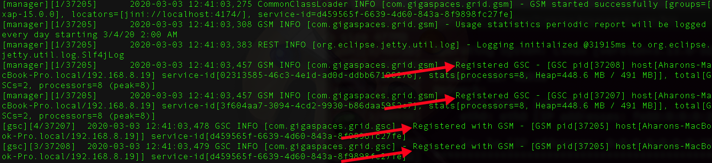
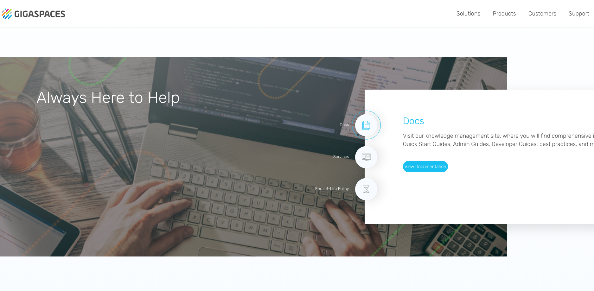
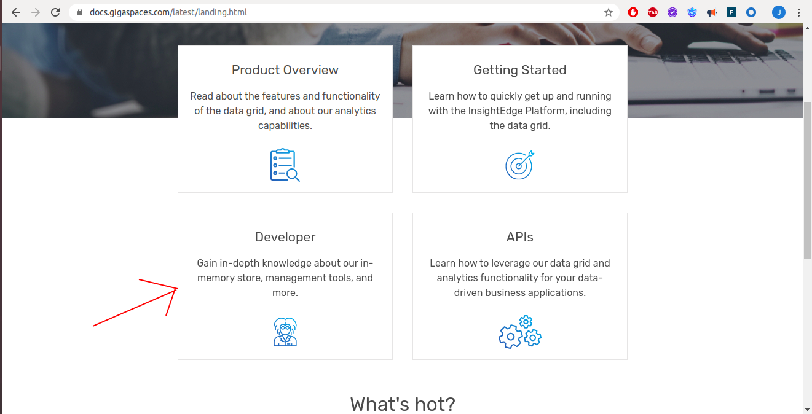
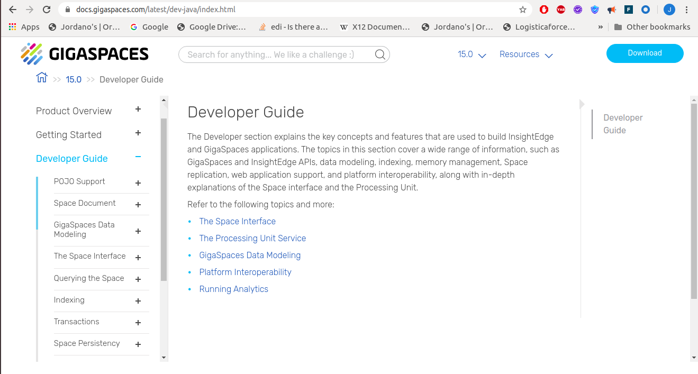

# xap-dev-training - lab01-introduction

This lab walks through installing and validating your XAP training environment, then confirms you can reach GigaSpaces' documentation and support resources online.

### Setup

1. Download GigaSpaces version 17.3.0 and extract it on your machine.
2. Put the `tryme` license into the `gs-license.txt` file located at the root of the XAP installation directory.
3. Download and install IntelliJ IDEA Community:  
   https://www.jetbrains.com/idea/download
4. Go to `$GS_HOME/bin`, open `setenv-overrides.sh`, and set:  
   `JAVA_HOME` -> point to your java installation directory  
   `GS_LOOKUP_GROUPS` -> set any unique identifier
5. Test your XAP installation. You will start a XAP process (gs-agent) and wait to see a message that the gs-agent started successfully with groups [<your user group>].

   ```
   cd ${GS_TRAINING_HOME}/gigaspaces-smart-cache-enterprise-17.3.0/bin
   ./gs.sh host run-agent --auto --gsc=2
   ```

   The following screen will appear (search for the message marked below):

   

   If you see the above, you have successfully installed the courseware for this course.
6. Stop the gs-agent process (2 options):  
   1. Ctrl+c
   2. `./gs.sh host kill-agent`

### Website and Online Documentation

1. Open a browser and go to the GigaSpaces site to validate internet connectivity:  
   www.gigaspaces.com
2. Click ** Resources -> Technical Documentation**.

   

   

   
