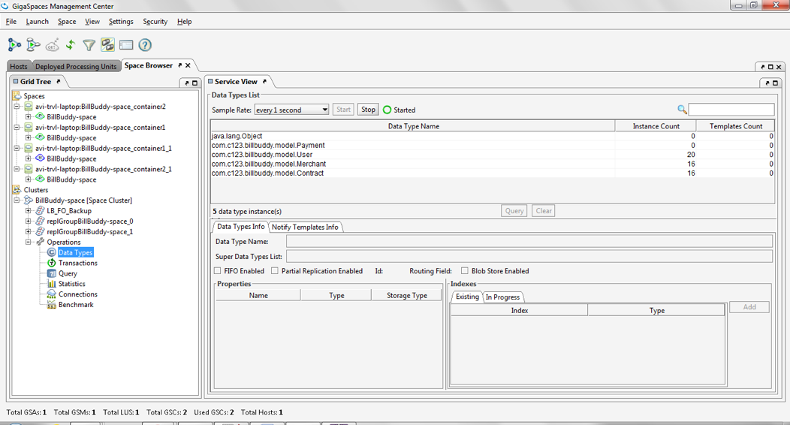
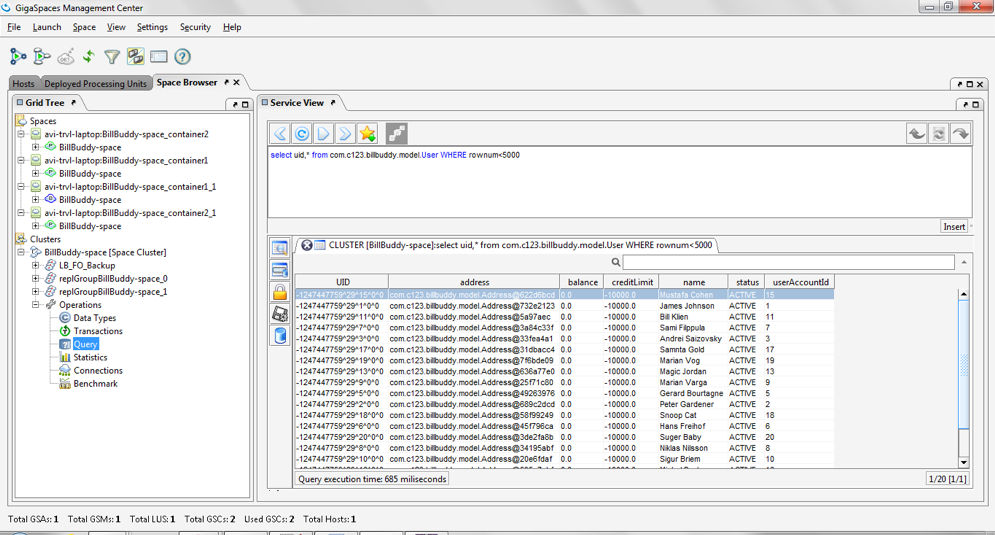
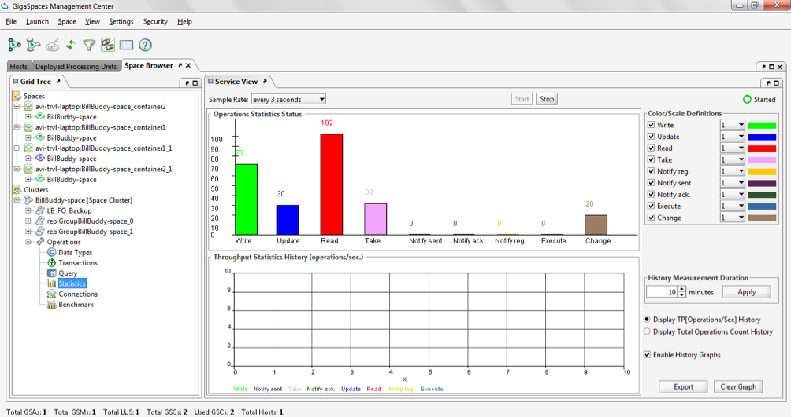
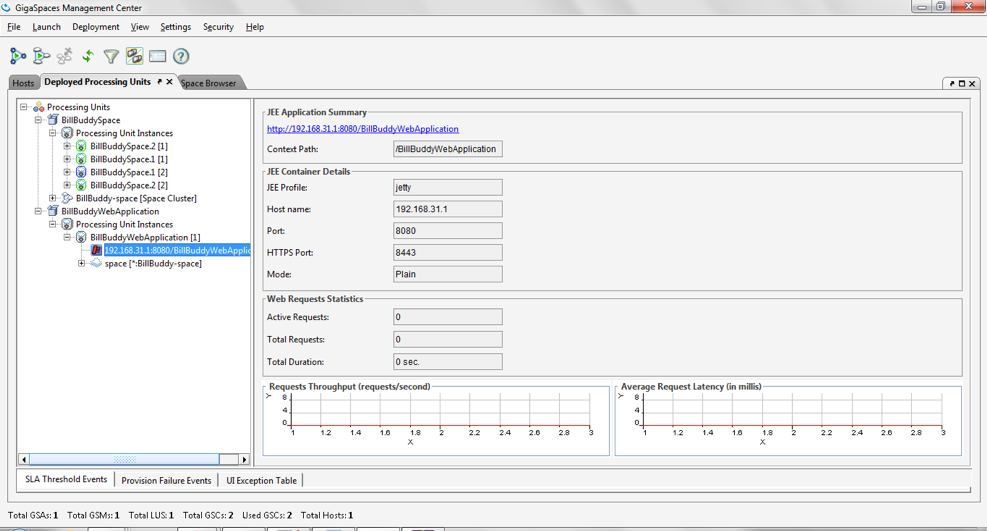
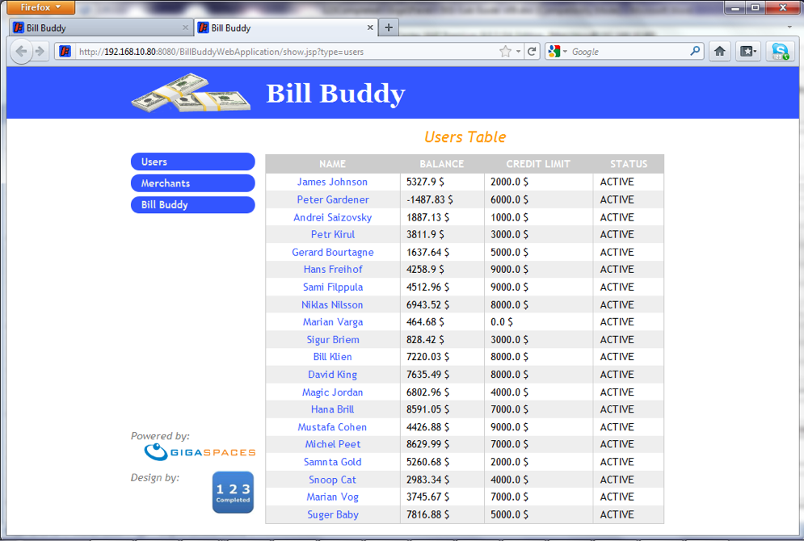

# xap-persist-training - lab02-BillBuddy_training_example

## Lab Goals

1. Experience an application deployment process.
2. Get familiar with the BillBuddy application.

## Lab Description

In this lab, we will focus on deploying the application rather than its code - this is the deployment process you will use throughout the labs from here on.

## 1. Start gs-agent and gs-ui

1. Navigate to `$GS_HOME/bin`.
2. Start gs-agent with one GSM, one LUS, and 2 GSCs:

   ```
   ./gs.sh host run-agent --auto --gsc=5
   ```
3. Start gs-ui:

   ```
   ./gs-ui.sh
   ```

## 2. Deploy BillBuddy_Space

1. Open `${GS_TRAINING_HOME}/lab02-BillBuddy_training_example` project with IntelliJ (open pom.xml).
2. Run `mvn install`:

   ```
   ${GS_TRAINING_HOME}/lab02-BillBuddy_training_example$ mvn install

   [INFO] ------------------------------------------------------------------------
   [INFO] Reactor Summary:
   [INFO] 
   [INFO] BillBuddyModel ..................................... SUCCESS [  1.025 s]
   [INFO] BillBuddy_Space .................................... SUCCESS [  0.211 s]
   [INFO] BillBuddyAccountFeeder ............................. SUCCESS [  0.217 s]
   [INFO] BillBuddyCurrentProfitDistributedExecutor .......... SUCCESS [  0.199 s]
   [INFO] BillBuddyWebApplication ............................ SUCCESS [  0.337 s]
   [INFO] BillBuddyPaymentFeeder ............................. SUCCESS [  0.205 s]
   [INFO] Lab2-solution ...................................... SUCCESS [  0.003 s]
   [INFO] ------------------------------------------------------------------------
   [INFO] BUILD SUCCESS
   ```
3. IntelliJ Path Variables: add `GS_LOOKUP_GROUPS` and `GS_LOOKUP_LOCATORS`.
4. Copy the `runConfigurations` directory to the `.idea` project directory.

   This will add the predefined applications to your IntelliJ IDE. The runConfigurations will be used in
   a later step to run components from the IDE.

   Restart IntelliJ.
5. Open a new terminal and navigate to `${GS_TRAINING_HOME}/gigaspaces-xap/bin/`:

   ```
   cd $GS_HOME/bin
   ```
6. Use the XAP CLI to deploy BillBuddy_Space:

   ```
   ./gs.sh pu deploy BillBuddy-Space ${GS_TRAINING_HOME}/lab02-BillBuddy_training_example/BillBuddy_Space/target/BillBuddy_Space.jar
   ```

## 3. Run BillBuddyAccountFeeder from IntelliJ

1. From the IntelliJ run configuration select BillBuddyAccountFeeder and run it. This application writes Users and Merchants to the Space.
2. Validate Users and Merchants were written to the space using gs-ui. Go to Space Browser Tab -> Clusters -> Operations -> Data Types, and examine the list of classes from which objects were written to the space.
   Via the CLI: `./gs.sh space info --type-stats BillBuddy-Space` lists the object count per data type.

   ```
   ./gs.sh space info --type-stats BillBuddy-Space
   ```

   
3. Query the list of Users by executing the following SQL. Choose the query option and copy the following SQL command to the SQL area:

   ```sql
   SELECT * FROM com.c123.billbuddy.model.User
   ```

   Note: the fully qualified class name is required (you can use copy/paste in gs-ui). Via the CLI:

   ```
   ./gs.sh space query --max-results=10 BillBuddy-Space com.c123.billbuddy.model.User
   ```

   

## 4. Run BillBuddyPaymentFeeder project

The BillBuddyPaymentFeeder application creates payments by randomly choosing a user, a merchant, and an amount, and performs the initial process of a payment. This includes deposit and withdrawal updates of each party's balance appropriately. After the payment is initially processed, it is written to the space for further processing. You will be further introduced to this application in a later lesson in greater detail. A new Payment is created every second.

1. Run the BillBuddyPaymentFeeder using IntelliJ, using the same instructions as used for the BillBuddyAccountFeeder.
2. Validate Payments were written to the space using gs-ui. You may choose to view Payment objects using the Query operation of gs-ui. Via the CLI, as in Section 3: `./gs.sh space info --type-stats BillBuddy-Space`.
3. Go to the statistics operation and see that a payment is actually added every second. You might be required to modify the sample rate and start the automatic refresh. Via the CLI, `./gs.sh space info --operation-stats BillBuddy-Space` shows the current `Write Count`; run it a couple of times a second or two apart and confirm it's climbing:

   ```
   ./gs.sh space info --operation-stats BillBuddy-Space
   ```

   
4. Go to the Data Types view under Operations. Which object counts are increasing? (Same CLI command as above, `--type-stats` instead of `--operation-stats`.)

## 5. Deploy BillBuddyWebApplication project

1. Open a new terminal and navigate to `${GS_TRAINING_HOME}/gigaspaces-xap/bin/`.
2. Use the XAP CLI to deploy BillBuddyWebApplication:

   ```
   ./gs.sh pu deploy BillBuddyWebApplication ${GS_TRAINING_HOME}/lab02-BillBuddy_training_example/BillBuddyWebApplication/target/BillBuddyWebApplication.war
   ```
3. Validate the application is deployed. Go to the Deployed Processing Units tab and expand the BillBuddyWebApplication PU. Via the CLI: `./gs.sh pu list` and confirm `BillBuddyWebApplication` shows as `INTACT`.

   ```
   ./gs.sh pu list
   ```

   
4. The URL is the application home page URL. Click on it to get to the application.

   
5. Congratulations, you have successfully deployed the BillBuddy application. Navigate through the application pages and investigate it.
