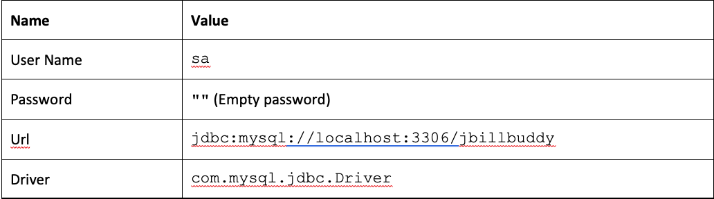

# xap-persist-training - lab03-mirror-exercise

## Lab Goals

1. Understand the tasks involved in implementing a mirror service. <br />
2. Implement a mirror service. <br />

## Lab Description
This lab includes 1 exercise in which we will perform the tasks required to implement a mirror service.
Use the slides from the lesson as a reference.

## 1. Lab setup
Make sure you restart gs-agent and gs-ui (or at least undeploy all Processing Units using gs-ui)

1. Open %GS_TRAINING_HOME%/lab03-mirror-exercise project with IntelliJ (open pom.xml)
2. Run mvn install

   ```
   [INFO] ------------------------------------------------------------------------
   [INFO] Reactor Summary:
   [INFO] 
   [INFO] lab03-exercise ...................................... SUCCESS [  0.162 s]
   [INFO] BillBuddyModel ..................................... SUCCESS [  0.811 s]
   [INFO] BillBuddy_Space .................................... SUCCESS [  0.177 s]
   [INFO] BillBuddyAccountFeeder ............................. SUCCESS [  0.196 s]
   [INFO] BillBuddyPaymentFeeder ............................. SUCCESS [  0.176 s]
   [INFO] BillBuddyPersistency ............................... SUCCESS [  0.718 s]
   [INFO] ------------------------------------------------------------------------
   [INFO] BUILD SUCCESS
   ```
3. Copy the `runConfigurations` directory to the `.idea` project directory.

   This will add the predefined applications to your IntelliJ IDE. The runConfigurations will be used in
   a later step to run components from the IDE.

   Restart IntelliJ.
4. Notice the following 5 modules in IntelliJ:

   - **BillBuddy_Space**: Contains a processing Unit with embedded space and business logic
   - **BillBuddyModel**: Defines all declarations that are required, in space side as well as the client application side. This project should be deployed with all other projects since all other projects are dependent on the model.
   - **BillBuddyAccountFeeder**: A client application (PU) that will be executed in IntelliJ. This application is responsible for writing Users and Merchants to the space.
   - **BillBuddyPaymentFeeder**: A client application that simulates an initial payment process. It creates a payment every second.
   - **BillBuddyPersistency**: The mirror service's persistence configuration (Hibernate SessionFactory, the mirror bean, and the `BillBuddyMirrorExceptionHandler` that handles persistence failures)

## 2. Persistency - Mirror Service Implementation

Set up PostgreSQL DB for this lesson (via Docker).

This lab uses Docker Compose to run PostgreSQL, instead of installing a database server natively.
(If you'd rather install MySQL natively, see [MYSQL_SETUP.md](MYSQL_SETUP.md) for the old instructions.
Note that going that route means reverting `BillBuddyPersistency`'s driver/dialect/JDBC URL back to MySQL.)

1. Make sure Docker is installed and running.
2. From this directory, start PostgreSQL:

   ```
   docker compose up -d
   ```

   This starts a `postgres:16` container named `billbuddy-postgres`, exposed on `localhost:5432`,
   and runs [init-postgresql.sql](init-postgresql.sql) on first boot to create the `jbillbuddy`
   database user (password `Giga1234$`) with privileges on the `jbillbuddy` database.
3. Validate the instance is up and the user/database were created:

   ```
   docker exec -it billbuddy-postgres psql -U jbillbuddy -d jbillbuddy -c '\dt'
   ```

   You should connect successfully and see no tables yet (Hibernate creates them for you at deploy time,
   via `hibernate.hbm2ddl.auto=create`).
4. To stop the database later:

   ```
   docker compose down
   ```

   Add `-v` to also delete the `postgres_data` volume (drops all data).

## 3. Configure the BillBuddy_Space

1. Configure your space to be mirror service aware.

   1. Modify your embedded Space pu.xml. mirrored="true" space element tag (Hint: BillBuddy_space pu.xml)

2. Map the data model to tables using Hibernate annotations.

   1. Search the data model to see which POJOs were chosen for persistency for our demo
   2. Examine specifically the User and Address relationship and try to figure out the meaning of the Hibernate annotations.

3. The following tasks will make it clearer how to implement a Mirror service.

   Hint: Use slides from the lesson as a reference. Most tasks are already implemented.

   1. Expand BillBuddyPersistency module and open the pu.xml file.
   2. Locate the data source bean (DB Connection properties). Write down the user and the password for the PostgreSQL DB database (You will use it later).
   3. Specify Space Components to be mapped using package scanning. Configure Spring to locate your Hibernate annotated classes.

      1. Fill in the package to be scanned where your persistent POJOs are located (Search the POJOs in the model that were annotated with @Entity and write their full name in the SessionFactory bean).

         `<property name="packagesToScan" value="com.c123.billbuddy.model" />`
      2. Hint: 4 classes only for this demo (but all in same package). Specify the mirror to recognize the mirror space (This step is already implemented)
      3. Complete the os-core:mirroros-core:source-space
      4. Use slides from the lesson as a reference.

## 4. Configure the mirror service

The mirror service requires having to be configured appropriately.
The lab is already configured correctly for you.
Your task is to locate the file in which the configuration is defined.
Basically you should be able to answer the following questions prior to configuring the environment.

1. What space am I mirroring? **Answer:** BillBuddy-space
2. Which POJOs am I to persist? **Answer:** In this lab we will persist: User, Merchant, Payment, ProcessingFee and Contract. Package Name: com.c123.billbuddy.model
3. What is the database (in most cases) that I am persisting to? **Answer:** we will use PostgreSQL DB (via Docker) for demo purposes.
4. What are the DB user name, DB password, JDBC URL and JDBC Driver? **Answer:**

   

## 5. Deploy the BillBuddy_Space and mirror service

The steps below are the exact commands used to deploy and verify this lab end-to-end (CLI-only,
no IntelliJ required). `$GS_HOME` is wherever you extracted the GigaSpaces distribution.

1. Run gs-agent:

   ```
   cd $GS_HOME/bin
   ./gs.sh host run-agent --auto --gsc=5
   ```

   Wait for the log to show the LUS, GSM, and all 5 GSCs started successfully before continuing.

2. (Optional) Run gs-ui to watch the deployment visually. Not required for the CLI flow below.

3. Make sure PostgreSQL is running (see Section 2 above: `docker compose up -d`), then build the reactor:

   ```
   cd <path-to-this-directory>
   mvn install -DskipTests
   ```

4. Deploy BillBuddy_Space to the service grid:

   ```
   ./gs.sh pu deploy BillBuddy-Space <path-to-this-directory>/BillBuddy_Space/target/BillBuddy_Space.jar
   ```

   ```
   [BillBuddy_Space.jar] successfully uploaded
   ·········
   Instance [BillBuddy-Space~2_1] successfully deployed
   Instance [BillBuddy-Space~1_1] successfully deployed
   ·
   Instance [BillBuddy-Space~1_2] successfully deployed
   Instance [BillBuddy-Space~2_2] successfully deployed

   Processing Unit [BillBuddy-Space] was successfully deployed
   ```

   This gives 4 instances (2 partitions × [1 primary + 1 backup]), one per GSC, leaving exactly 1 free
   GSC for the mirror below (`max-instances-per-vm="1"` in `BillBuddy_Space`'s `sla.xml` spreads them out).

5. Deploy BillBuddyPersistency (the mirror service) to the service grid:

   ```
   ./gs.sh pu deploy BillBuddyPersistency <path-to-this-directory>/BillBuddyPersistency/target/BillBuddyPersistency.jar
   ```

   ```
   [BillBuddyPersistency.jar] successfully uploaded
   ····
   Instance [BillBuddyPersistency~1] successfully deployed

   Processing Unit [BillBuddyPersistency] was successfully deployed
   ```

6. Validate the mirror service deployed using `gs.sh pu list`:

   ```
   ./gs.sh pu list
   ```

   ```
   NAME                    TYPE        SPACE              TOPOLOGY           STATUS    RESOURCE                    QUIESCED    INSTANCES COUNT
   BillBuddy-Space         STATEFUL    BillBuddy-space    partitioned 2,1    INTACT    BillBuddy_Space.jar         false       4
   BillBuddyPersistency    MIRROR      mirror-service     -                  INTACT    BillBuddyPersistency.jar    false       1
   ```

7. Check the GSC log and validate successful deployment. Search for a "Channel established"
   message on the `BillBuddyPersistency` instance for *both* primary space instances (grep the GSC log
   under `$GS_HOME/logs`, or use gs-ui):

   ```
   BillBuddyPersistency INFO [com.gigaspaces.replication.channel.in.BillBuddy-space1.primary-backup-reliable-async-mirror-1.mirror-service] - Channel established [...]
   BillBuddyPersistency INFO [com.gigaspaces.replication.channel.in.BillBuddy-space2.primary-backup-reliable-async-mirror-2.mirror-service] - Channel established [...]
   ```

## 6. Enter data

1. Feed Users and Merchants. `BillBuddyAccountFeeder` has a plain `main()`, so it can run directly:

   ```
   cd BillBuddyAccountFeeder
   java -Dcom.gs.jini_lus.locators=localhost:4174 -Dcom.gs.jini_lus.groups=xap-17.3.0 \
     -cp "target/BillBuddyAccountFeeder:target/BillBuddyAccountFeeder/lib/*:$(find $GS_HOME/lib/required $GS_HOME/lib/platform -iname '*.jar' | tr '\n' ':')" \
     com.c123.billbuddy.client.AccountFeeder
   ```

   (In IntelliJ, just use the predefined `BillBuddyAccountFeeder` run configuration instead.)

2. Feed Payments. `BillBuddyPaymentFeeder` is itself a Spring/PU bean (uses `@Resource GigaSpace`),
   so it's launched as an integrated processing unit rather than via a plain `main()`. It creates a payment
   every second and runs until killed:

   ```
   cd BillBuddyPaymentFeeder
   java -Dcom.gs.jini_lus.locators=localhost:4174 -Dcom.gs.jini_lus.groups=xap-17.3.0 \
     -cp "target/BillBuddyPaymentFeeder:target/BillBuddyPaymentFeeder/lib/*:$(find $GS_HOME/lib/required $GS_HOME/lib/platform -iname '*.jar' | tr '\n' ':')" \
     org.openspaces.pu.container.integrated.IntegratedProcessingUnitContainer
   ```

   (In IntelliJ, use the predefined `BillBuddyPaymentFeeder` run configuration instead, with the same effect.)
   Let it run for ~10-15 seconds, then stop it (Ctrl-C, or in IntelliJ just stop the run configuration).

## 7. Verify the Mirror Replication

1. Run some queries in PostgreSQL to confirm the mirror actually replicated the data:

    ```
    docker exec billbuddy-postgres psql -U jbillbuddy -d jbillbuddy -c '
      SELECT '"'"'User'"'"'          t, COUNT(*) FROM "User"
      UNION ALL SELECT '"'"'Merchant'"'"',      COUNT(*) FROM "Merchant"
      UNION ALL SELECT '"'"'Contract'"'"',      COUNT(*) FROM "Contract"
      UNION ALL SELECT '"'"'Payment'"'"',       COUNT(*) FROM "Payment"
      UNION ALL SELECT '"'"'ProcessingFee'"'"', COUNT(*) FROM "ProcessingFee";'
    ```

    Expected result (counts will vary run to run, but all 5 tables should be non-zero):

    ```
          t        | count
    ----------------+-------
     User           |    20
     Merchant       |    16
     Contract       |    16
     Payment        |    12
     ProcessingFee  |    12
    ```

    Note table/column names are double-quoted (`"User"`, not `User`). See the Known Gotchas section below.

2. Monitoring the Mirror service: use gs-ui's Processing Unit statistics view to watch the
   mirror's total operation count climb as the feeders run. Via the CLI, use
   `./gs.sh space info-instance --replication-stats <instance ID>` against each `BillBuddy-Space` primary
   instance (the primaries are what own the replication channel to the mirror; see the "Channel
   established" log line from Section 5, step 7) to watch the mirror replication activity climb while the
   feeders are running:

   ```
   ./gs.sh space list-instances BillBuddy-Space
   ./gs.sh space info-instance --replication-stats BillBuddy-Space~1_1
   ./gs.sh space info-instance --replication-stats BillBuddy-Space~2_1
   ```

3. Compare the number of mirror total operations against the overall number of POJOs you have.
   Count only POJOs you persist.
   Can you explain why there are many more mirror operations than POJOs?

## 8. Known Gotchas (XAP 17.3.0 / Spring 7.0.8 / Hibernate 7.1.0.Final)

This lab was upgraded to modern dependency versions, which surfaced a few non-obvious runtime issues
not caught by `mvn install`; worth knowing if you hit similar failures deploying `BillBuddyPersistency`:

1. **`org.springframework.orm.hibernate5.LocalSessionFactoryBean` no longer exists.** Spring Framework
   7 removed that package entirely. The replacement is `org.springframework.orm.jpa.hibernate.LocalSessionFactoryBean`
   (same property setters: `dataSource`, `packagesToScan`, `hibernateProperties`; just a new home),
   already updated in `BillBuddyPersistency`'s `pu.xml`.
2. **`spring-orm` isn't on the mirror PU's classpath by default.** The parent `pom.xml` declares it
   `provided` (meant to be supplied by the GSC container), but this XAP distribution ships it under
   `lib/optional/`, not the GSC's default classpath. `BillBuddyPersistency/pom.xml` re-declares it as
   `compile` scope so the assembly plugin bundles it into the PU's own `lib/` folder (same trick already
   used for the JDBC driver); this pattern is required for any future PU-only dependency too.
3. **`User` is a reserved word in PostgreSQL.** Hibernate's unquoted `CREATE TABLE User (...)` DDL fails
   with a syntax error (MySQL is more permissive here). Fixed via `hibernate.globally_quoted_identifiers=true`
   in `pu.xml` rather than renaming the entity; this quotes every generated identifier, so query the
   tables with quoted, case-preserved names (`"User"`, `"Merchant"`, etc.), not lowercase unquoted ones.