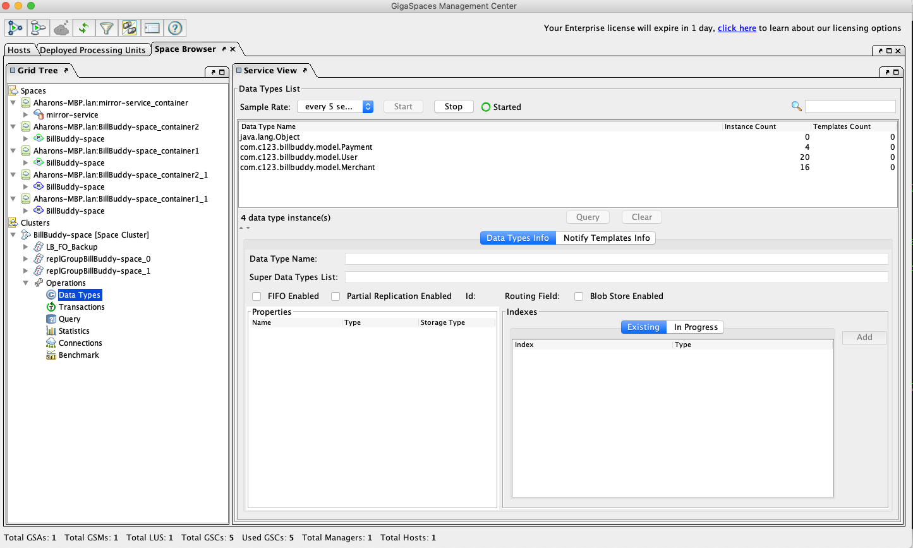
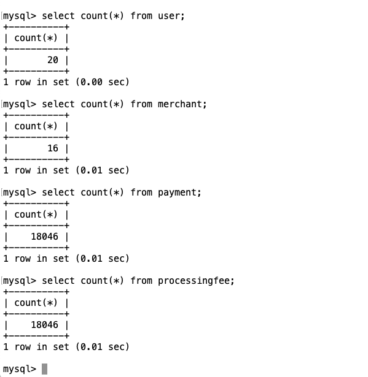
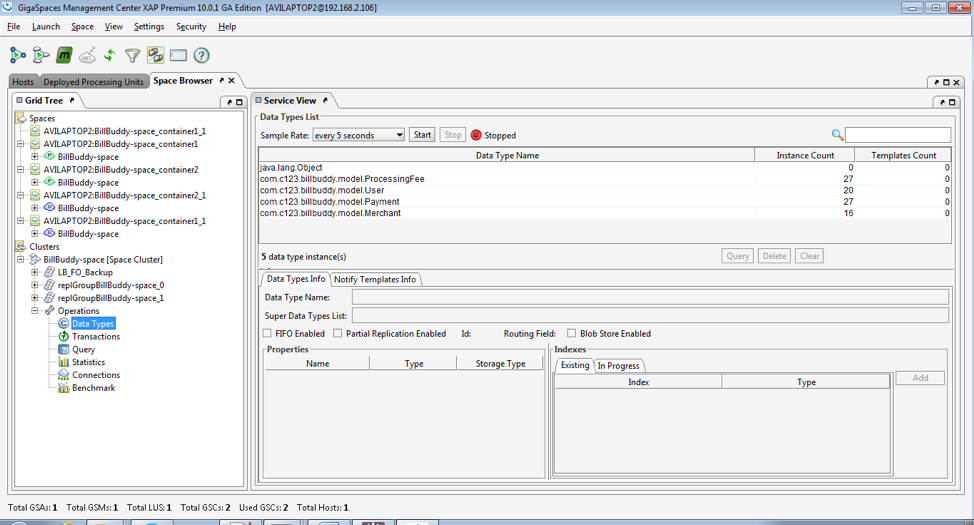

# xap-persist-training - lab04-initial_load-solution

## Lab Goals

Implement and configure Initial Load for Space Classes.

## Lab Description

During this lab you will deploy the BillBuddy application and load initial data into the space from a
PostgreSQL database (running via Docker, see [docker-compose.yaml](docker-compose.yaml)).
The PostgreSQL data was populated as part of Lab 3 (the mirror service lab); this lab loads that data
into the space via initial load.
In the first exercise (Section 2) you will configure initial load of the entire dataset from the
database into the space.
In the second exercise (Section 3) you will configure a custom initial load to load partial data into
the space based on a custom load query.

## 1. Lab setup

Make sure you restart gs-agent and gs-ui (or at least undeploy all Processing Units using gs-ui)

1. Open %GS_TRAINING_HOME%/lab04-initial_load-solution project with IntelliJ (open pom.xml)
2. Run `mvn install`

   ```
   [INFO] ------------------------------------------------------------------------
   [INFO] Reactor Summary:
   [INFO] 
   [INFO] lab04-solution ...................................... SUCCESS [  0.226 s]
   [INFO] BillBuddyModel ..................................... SUCCESS [  2.071 s]
   [INFO] BillBuddy_Space .................................... SUCCESS [  1.590 s]
   [INFO] BillBuddyAccountFeeder ............................. SUCCESS [  0.709 s]
   [INFO] BillBuddyPaymentFeeder ............................. SUCCESS [  0.545 s]
   [INFO] BillBuddyPersistency ............................... SUCCESS [  1.218 s]
   [INFO] BillBuddy_SpaceCustomInitialLoad ................... SUCCESS [  0.523 s]
   [INFO] ------------------------------------------------------------------------
   [INFO] BUILD SUCCESS
   ```
3. Copy the `runConfigurations` directory to the `.idea` project directory.

   This will add the predefined applications to your IntelliJ IDE. The runConfigurations will be used in
   a later step to run components from the IDE.

   Restart IntelliJ.
4. Notice the following 6 modules in IntelliJ:

   - **BillBuddy_Space**: Contains a processing Unit with embedded space and business logic
   - **BillBuddyModel**: Defines all declarations that are required, in space side as well as the client application side. This project should be deployed with all other projects since all other projects are dependent on the model.
   - **BillBuddyAccountFeeder**: A client application (PU) that will be executed in IntelliJ. This application is responsible for writing Users and Merchants to the space.
   - **BillBuddyPaymentFeeder**: A client application that simulates an initial payment process. It creates a payment every second.
   - **BillBuddyPersistency**: The mirror service's persistence configuration (Hibernate SessionFactory and the mirror bean).
   - **BillBuddy_SpaceCustomInitialLoad**: The space PU used in Section 3, configured with a custom initial load query that loads only a subset of the data.

## 2. Implement Basic Initial Load

1. Open project BillBuddy_Space
2. Edit `pu.xml`:

   1. Space definition (Fix the TODO): define the `space-data-source` to be the `hibernateSpaceDataSource` bean.
   2. In the `sessionFactory` bean, add a suitable property for scanning Hibernate annotations.

3. Test Initial Load:

   1. Run `mvn package` so your fixes are packaged into the space PU jar.
   2. Make sure the PostgreSQL container is up and running: `docker compose up -d` (see [docker-compose.yaml](docker-compose.yaml)). If you don't already have it populated, refer to Lab 3 (the mirror service lab) to seed it first.
   3. Run gs-agent (`./gs.sh host run-agent --auto --gsc=4`).
   4. Run gs-ui.
   5. Deploy BillBuddy_Space to the service grid (`./gs.sh pu deploy BillBuddy-Space <path-to-this-directory>/BillBuddy_Space/target/BillBuddy_Space.jar`).
   6. Check that the space loaded Users, Merchants, Payments, and Processing Fees. You can verify this
      via the CLI with `./gs.sh space info --type-stats BillBuddy-Space`, which lists the object count
      per data type:

      ```
      ./gs.sh space info --type-stats BillBuddy-Space
      ```

      **Note:** This lab is based on the completion and execution of Lab 3.

      

   7. Execute a SQL statement and count that all objects have been loaded into the space:

      1. Connect to the PostgreSQL database (started above).
      2. Connect to the postgres instance:

         ```
         docker exec -it billbuddy-postgres psql -U jbillbuddy -d jbillbuddy
         ```
      3. Run `select count(*) from "User";`
      4. Run `select count(*) from "Merchant";`
      5. Run `select count(*) from "Payment";`
      6. Run `select count(*) from "ProcessingFee";`
      7. Make sure you see the results.

      **Note:** table/column names are double-quoted (`"User"`, not `user`) because `hibernate.globally_quoted_identifiers=true` is set. See the "Known Gotchas" section at the bottom of this README.

      

   8. Stop gs-agent and gs-ui.

## 3. Implement Custom Initial Load Queries

1. Edit the `Payment` space class (in the `BillBuddyModel` project):

   1. Add a custom load method to the `Payment` class (Fix the TODO).
   2. `public String initialLoadQuery()`
   3. Annotate this method with `@SpaceInitialLoadQuery`.
   4. The method returns a string of the where query to specify the custom loading criteria.
   5. Specify a criterion that returns only payments greater than 50.

2. Edit `pu.xml` (of the `BillBuddy_SpaceCustomInitialLoad` project):

   1. Hibernate Space Data Source definition (Fix the TODO):
   2. Fix the `hibernateSpaceDataSource` bean.
   3. Add a new property, `initialLoadQueryScanningBasePackages`, that enables scanning of packages for custom initial loading. Fill in the list with one entry, `com.c123.billbuddy.model`, in order to scan the change we have made to payments.

## 4. Test Initial Load

1. Make sure the PostgreSQL container is up and running (`docker compose up -d`).
2. Run gs-agent (restart if one is already running).
3. Run gs-ui (restart if one is already running).
4. Deploy BillBuddy_SpaceCustomInitialLoad to the service grid:

   ```
   ./gs.sh pu deploy BillBuddy_SpaceCustomInitialLoad <path-to-this-directory>/BillBuddy_SpaceCustomInitialLoad/target/BillBuddy_SpaceCustomInitialLoad.jar
   ```
5. Check that the space loaded Users, Merchants, Payments, and Processing Fees. As in Section 2, you can
   verify this via the CLI with `./gs.sh space info --type-stats BillBuddy-Space`.

   
6. Run a Payment query on the space to make sure only partial payments were loaded (only those greater
   than 50). Via the CLI:

   ```
   ./gs.sh space query --filter="paymentAmount > 50" --max-results=10 BillBuddy-Space com.c123.billbuddy.model.Payment
   ```

   All returned rows should have `paymentAmount` greater than 50; querying with `--filter="paymentAmount <= 50"`
   should return no results.
7. Check that the payments are routed between the 2 partitions. Get the instance IDs with
   `./gs.sh space list-instances BillBuddy-Space`, then check the `Payment` count on each partition's
   primary instance (e.g. `BillBuddy-Space~1_1` and `BillBuddy-Space~2_1`):

   ```
   ./gs.sh space list-instances BillBuddy-Space
   ./gs.sh space info-instance --type-stats BillBuddy-Space~1_1
   ./gs.sh space info-instance --type-stats BillBuddy-Space~2_1
   ```

   Both instances should show a non-zero `Payment` count.
8. Execute a SQL statement and count that all objects have been loaded into the space:

   1. Connect to the PostgreSQL database (started above).
   2. Connect to the postgres instance:

      ```
      docker exec -it billbuddy-postgres psql -U jbillbuddy -d jbillbuddy
      ```
   3. Run `select count(*) from "Payment";`
   4. Check out how many records were left out.
   5. Make sure you see the results.

## 5. Known Gotchas (XAP 17.3.0 / Spring 7.0.8 / Hibernate 7.1.0.Final)

This lab was upgraded to modern dependency versions and switched from MySQL to PostgreSQL (see the
mirror lab, Lab 3, for the Docker/PostgreSQL setup this lab's data comes from). That surfaced the same
runtime issues documented in Lab 3's README, plus one new one specific to this lab's `BillBuddy_Space`
and `BillBuddy_SpaceCustomInitialLoad` modules; none caught by `mvn install`, only at PU deploy time:

1. **`org.springframework.orm.hibernate5.LocalSessionFactoryBean` no longer exists.** Spring Framework 7
   removed that package entirely; the replacement is `org.springframework.orm.jpa.hibernate.LocalSessionFactoryBean`
   (same property setters). Updated in all three `pu.xml` files that declare a `sessionFactory` bean
   (`BillBuddyPersistency`, `BillBuddy_Space`, `BillBuddy_SpaceCustomInitialLoad`).
2. **`spring-orm` isn't on any PU's classpath by default.** It's `provided`-scope in `BillBuddyPersistency`'s
   own declaration, and wasn't declared *at all* in `BillBuddy_Space`/`BillBuddy_SpaceCustomInitialLoad`
   despite both using Hibernate directly for initial load. All three now declare it `compile`-scope so
   it's bundled into each PU's own `lib/` (this XAP distribution ships it under `lib/optional/`, not the
   GSC's default classpath).
3. **`BillBuddy_Space` and `BillBuddy_SpaceCustomInitialLoad` use an explicit dependency *allowlist* in
   their `assembly.xml`** (`<includes>mysql:mysql-connector-java</includes>`, `<includes>org.hibernate:hibernate-core</includes>`),
   unlike `BillBuddyPersistency`'s exclude-based one. Swapping the driver/dialect and Hibernate's groupId
   (`org.hibernate` → `org.hibernate.orm`, required by Hibernate 6+) silently dropped those jars from the
   bundled PU. Deployment succeeded but failed at runtime with the `LocalSessionFactoryBean` gotcha above,
   until the `assembly.xml` includes were updated to the new GAVs and `org.springframework:spring-orm` was
   added to the list. **If you add or rename a dependency in these two modules' `pom.xml`, check `assembly.xml`
   too**; it won't get bundled automatically like it does in `BillBuddyPersistency`.
4. **`User` is a reserved word in PostgreSQL.** Hibernate's unquoted `CREATE TABLE User (...)` DDL fails
   with a syntax error (MySQL is more permissive). Fixed via `hibernate.globally_quoted_identifiers=true`
   in all three `pu.xml` files rather than renaming the entity; query tables with quoted, case-preserved
   names (`"User"`, `"Payment"`, etc.), not lowercase unquoted ones.
