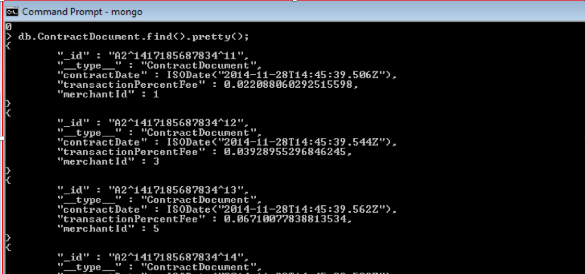
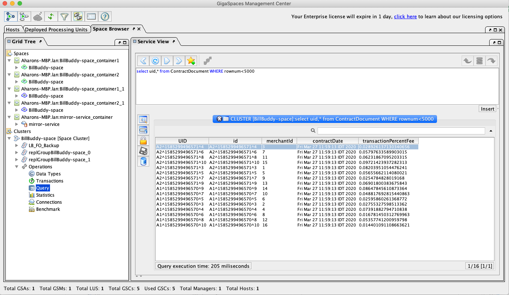

# xap-persist-training - lab05-nosql_spacedocument_persistence-solution

## Lab Goals

Implement and configure persistency for Space Document using MongoDB.

## Lab Description

1. During this lab you will deploy the BillBuddy application and examine the MongoDB database to confirm that the Contract space documents are being persisted.
2. After persisting, you will test initial load to validate that those persisted Space Documents are uploaded into the space during space deployment, in the initial load process.

## 1. Lab setup

In this lab we will install MongoDB and use the console to create the database and query information.

Make sure you restart gs-agent and gs-ui (or at least undeploy all Processing Units using gs-ui)

1. Open %GS_TRAINING_HOME%/lab05-nosql_spacedocument_persistence-solution project with IntelliJ (open pom.xml)
2. Run `mvn package`

   ```
   [INFO] ------------------------------------------------------------------------
   [INFO] Reactor Summary:
   [INFO] 
   [INFO] lab05-solution ...................................... SUCCESS [  0.239 s]
   [INFO] BillBuddyModel ..................................... SUCCESS [  2.050 s]
   [INFO] BillBuddy_Space .................................... SUCCESS [  2.328 s]
   [INFO] BillBuddyAccountFeeder ............................. SUCCESS [  0.662 s]
   [INFO] BillBuddyPaymentFeeder ............................. SUCCESS [  0.537 s]
   [INFO] BillBuddyPersistency ............................... SUCCESS [  1.623 s]
   [INFO] ------------------------------------------------------------------------
   [INFO] BUILD SUCCESS
   ```
3. Copy the runConfigurations directory to the `.idea` project directory.

   This will add the predefined applications to your IntelliJ IDE. The runConfigurations will be used in
   a later step to run components from the IDE.

   Restart IntelliJ.
4. Notice the following 5 modules in IntelliJ:

   - **BillBuddy_Space**: Contains a processing Unit with embedded space and business logic
   - **BillBuddyModel**: Defines all declarations that are required, in space side as well as the client application side. This project should be deployed with all other projects since all other projects are dependent on the model.
   - **BillBuddyAccountFeeder**: A client application (PU) that will be executed in IntelliJ. This application is responsible for writing Users and Merchants to the space.
   - **BillBuddyPaymentFeeder**: A client application that simulates an initial payment process. It creates a payment every second.
   - **BillBuddyPersistency**: The MongoDB persistence configuration for the mirror service, used to persist Contract space documents.

## 2. Mongo Installation

This lab uses Docker Compose to run MongoDB, instead of installing it natively.
(If you'd rather install MongoDB natively, see [MONGODB_SETUP.md](MONGODB_SETUP.md) for the old instructions.)

1. Shutdown/kill all XAP processes.
2. Make sure Docker is installed and running.
3. From this directory, start MongoDB:

   ```
   docker compose up -d
   ```

   This starts a `mongo:7` container named `billbuddy-mongo`, exposed on `localhost:27017`. No
   authentication/user setup is needed, since the app connects with no credentials (see the `mongoClient`
   bean in each `pu.xml`), and MongoDB creates the `mnbillbuddy` database automatically on first write.
4. To stop it later: `docker compose down` (add `-v` to also delete the `mongo_data` volume).

## 3. Configure Projects To Mongo Persistency

1. Configure BillBuddy_Space to initial load from Mongo:

   Edit `pu.xml`.

   1. Configure the `mongoClient` bean (Fix TODO):

      1. Database name in the `db` property should be `mnbillbuddy`.
      2. `com.mongodb.MongoClient` constructor arguments:

         1. Server name (as the string value); use `localhost` for our lab.
         2. Port number (as the int value); the default MongoDB port number is 27017.
   2. Configure the `spaceDataSource` bean (Fix TODO):

      1. Configure the `mongoClientConnector` property to point to the `mongoClient` bean.
   3. Configure `BillBuddy-space` to work with initial load (Fix TODO):

      1. Configure the data source defined in step 2 above.

2. Configure BillBuddyPersistency to persist Contract Documents to Mongo:

   Edit `pu.xml`.

   1. Configure the `mongoClient` bean (Fix TODO):

      1. Database name in the `db` property: `mnbillbuddy`.
      2. `com.mongodb.MongoClient` constructor arguments:

         1. Server name (as the string value); use `localhost` for our lab.
         2. Port number (as the int value); the default MongoDB port number is 27017.
   2. Configure the `spaceSynchronizationEndpoint` bean (Fix TODO):

      1. Configure the `mongoClientConnector` property to point to the `mongoClient` bean.
   3. Configure BillBuddyPersistency (the mirror service) to work with MongoDB (Fix TODO):

      1. Configure the `space-sync-endpoint` defined in step 2 above.

## 4. Deploy the Grid and Space

1. Make sure the MongoDB container is up and running: `docker compose up -d` (see [docker-compose.yaml](docker-compose.yaml)).
2. Start the service grid:

   ```
   ./gs.sh host run-agent --auto --gsc=5
   ```
3. Run gs-ui:

   ```
   ./gs-ui.sh
   ```
4. Deploy BillBuddy_Space to the service grid:

   ```
   ./gs.sh pu deploy BillBuddy-Space <path-to-this-directory>/BillBuddy_Space/target/BillBuddy_Space.jar
   ```
5. Deploy BillBuddyPersistency to the service grid:

   ```
   ./gs.sh pu deploy BillBuddyPersistency <path-to-this-directory>/BillBuddyPersistency/target/BillBuddyPersistency.jar
   ```
6. Validate the deployment via the CLI (in addition to, or instead of, gs-ui): run `./gs.sh pu list` and
   confirm both `BillBuddy-Space` and `BillBuddyPersistency` show as `INTACT`:

   ```
   ./gs.sh pu list
   ```

## 5. Verify MongoDB Persistence

1. From the IntelliJ run configuration select BillBuddyAccountFeeder and run it. The account feeder will create only Contract documents for this example.
2. Validate that the Contract documents were written into the MongoDB database. Connect to the MongoDB container's shell:

   - Run:

     ```
     docker exec -it billbuddy-mongo mongosh
     ```
   - Write the command `use mnbillbuddy`:

     ```
     > use mnbillbuddy
     switched to db mnbillbuddy
     >
     ```
   - Type `show collections` - this will display all object types stored in Mongo, similar to `show tables`:

     ```
     > show collections
     ```
   - Run `db.ContractDocument.find().pretty();`:

     ```
     > db.ContractDocument.find().pretty();
     ```
   - See that you get records for Contract documents. If you want to remove the records for re-running the test:

     ```
     > db.ContractDocument.remove({})
     ```

   

## 6. Verify Initial Load

1. Undeploy BillBuddyPersistency.
2. Undeploy BillBuddy_Space.
3. Stop the service grid: `./gs.sh host kill-agent`
4. Start the service grid.
5. Deploy BillBuddy_Space.
6. Check that you got 16 objects for ContractDocument (that were loaded in the initial load process).
   You can verify this via the CLI with `./gs.sh space info --type-stats BillBuddy-Space`, which lists the
   object count per data type:

   ```
   ./gs.sh space info --type-stats BillBuddy-Space
   ```

   
