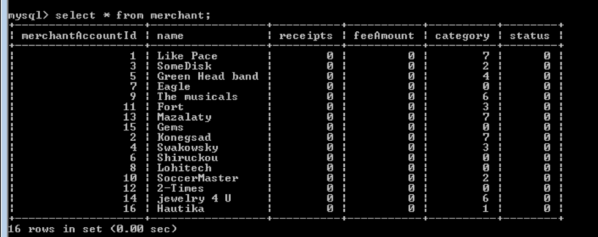
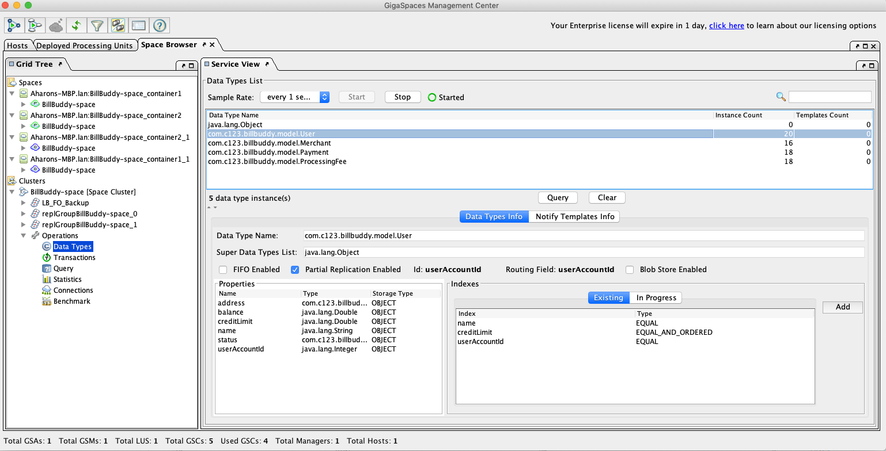

# xap-persist-training - lab06-custom_persistence-exercise

## Lab Goals

Implement and configure persistency for Space class using custom persistency implementation.

## Lab Description

1. During this lab you will deploy the BillBuddy application and persist data from the space to a relational database using a custom persistency hook implementation.
2. We will utilize standard JDBC calls instead of Hibernate.
3. The lab already includes an implemented DAO with all JDBC code in it. You are only required to modify the relevant XAP files and `pu.xml`.
4. You can use this demo as a reference for any other implementation you require.
5. Once you persist the space class to the database, you will configure initial load to load the space class previously stored in the relational database.

## Lab setup

Make sure you restart gs-agent and gs-ui (or at least undeploy all Processing Units using gs-ui)

In this lab we will cover:

1. Creation of a database instance in PostgreSQL.
2. Configuration of the space and mirror service to use custom-made persistency for persisting space classes and loading them in initial load via JDBC (not using Hibernate).
3. Implementing a set of classes to support custom persistency.

## 1. Build the project lab

1. Open %GS_TRAINING_HOME%/lab06-custom_persistence-exercise project with IntelliJ (open pom.xml)
2. Run `mvn install`

   ```
   [INFO] ------------------------------------------------------------------------
   [INFO] Reactor Summary:
   [INFO] 
   [INFO] lab06-exercise ...................................... SUCCESS [  0.171 s]
   [INFO] BillBuddyModel ..................................... SUCCESS [  0.907 s]
   [INFO] BillBuddy_Space .................................... SUCCESS [  0.903 s]
   [INFO] BillBuddyAccountFeeder ............................. SUCCESS [  0.233 s]
   [INFO] BillBuddyPaymentFeeder ............................. SUCCESS [  0.205 s]
   [INFO] BillBuddyPersistency ............................... SUCCESS [  0.704 s]
   [INFO] ------------------------------------------------------------------------
   [INFO] BUILD SUCCESS
   ```
3. Copy the `runConfigurations` directory to the `.idea` project directory.

   This will add the predefined applications to your IntelliJ IDE. The runConfigurations will be used in
   a later step to run components from the IDE.

   Restart IntelliJ.
4. Notice the following 5 modules in IntelliJ:

   - **BillBuddy_Space**: Contains a processing Unit with embedded space and business logic
   - **BillBuddyModel**: Defines all declarations that are required, in space side as well as the client application side. This project should be deployed with all other projects since all other projects are dependent on the model.
   - **BillBuddyAccountFeeder**: A client application (PU) that will be executed in IntelliJ. This application is responsible for writing Users and Merchants to the space.
   - **BillBuddyPaymentFeeder**: A client application that simulates an initial payment process. It creates a payment every second.
   - **BillBuddyPersistency**: The custom JDBC persistence configuration (`BillBuddySpaceSynchronizationEndpoint` and the DAO layer used to write space objects to PostgreSQL).

## 2. Database setup

This lab uses Docker Compose to run PostgreSQL, instead of installing a database server natively.
(If you'd rather install MySQL natively, see [MYSQL_SETUP.md](MYSQL_SETUP.md) for the old instructions.
Note that going that route means reverting the `dataSource` beans, driver dependency, and the DAO SQL
back to MySQL; see the "Known Gotchas" section below.)

**Note:** this container listens on host port **5433**, not the usual 5432. That's reserved on this
machine for other labs' `billbuddy-postgres` container (Lab 3's mirror DB). Adjust if that's not the
case for you.

1. Make sure Docker is installed and running.
2. From this directory, start PostgreSQL:

   ```
   docker compose up -d
   ```

   This starts a `postgres:16` container named `billbuddy-postgres-custom`, with a `root` superuser (no
   password, matching what `pu.xml`'s `dataSource` beans already expect) and a `custbillbuddy` database,
   exposed on `localhost:5433`.
3. Validate that your instance is up and the database was created:

   ```
   docker exec -it billbuddy-postgres-custom psql -U root -d custbillbuddy -c '\dt'
   ```

   Output: no tables yet (the DAO layer creates them itself on first connect, via `initWithCreateIfMissing()`).
4. To stop it later: `docker compose down` (add `-v` to also delete the `postgres_data` volume).

## 3. Mirror Service Configuration and Setup

1. Open the BillBuddyPersistency project.
2. Implement `BillBuddySpaceSynchronizationEndpoint`:

   1. Fix the TODO.
   2. `onOperationsBatchSynchronization()`: you are required to store all objects that are taking part in a transaction. We have provided a `storeObject(Object obj)` method that is part of the class.

      1. Examine the `storeObject(Object obj)` method. It uses an already-implemented native DAO layer that handles all JDBC commands. Feel free to examine the DAO code as well.
      2. Fix the missing implementation; the method receives a batch of operations as input.
      3. Store each of those objects using the private `storeObject(Object obj)` method.
3. Edit `pu.xml`:

   1. Fix the TODO.
   2. Add Spring scanning for the package where the `SpaceSynchronizationEndpoint` exists.
   3. Add a definition for the supported space classes as part of the custom `SpaceSynchronizationEndpoint` (bean `supportedManageSpaceClasses`).
   4. For the `billBuddySpaceSynchronizationEndpoint` bean, fix:

      1. The `datasource` property, to point to the database data source.
      2. The class name for the `SpaceSynchronizationEndpoint`.
   5. For `os-core:mirror`, fix the `space-sync-endpoint` property to reference the custom `SpaceSynchronizationEndpoint` (bean `billBuddySpaceSynchronizationEndpoint`).

## 4. Space Configuration For Initial Load

1. Open the BillBuddy_Space project.
2. Implement `BillBuddySpaceDataSource`:

   1. This class will be used to load data from the database.
   2. Fix the TODO.
   3. Method `initialDataLoad()`:

      1. Fix the missing implementation: the method reads from each DAO (`readFromDB()`) and returns the combined results as an iterator.
      2. Load all objects from the database using the different DAO objects. Hint: check the private members to see what DAOs are available to you.
3. Implement `CustomDataIterator` (no code changes are required; review the code):

   1. This class is used to return the results. No fix is required, but you can review the simple implementation.
4. Implement `BillBuddyCustomFactoryBean`:

   1. This class will be used as a factory to create the custom space data source.
   2. Fix the TODOs.
   3. Method `getObject()`:

      1. Fix the missing implementation of creating/initializing the private member `billBuddySpaceDataSource`.
   4. Method `getObjectType()`:

      1. Fix the missing implementation; return `BillBuddySpaceDataSource.class`.
5. Edit `pu.xml`:

   1. Fix the TODO.
   2. Add Spring scanning for the package that holds the definitions of `BillBuddyCustomFactoryBean` and `BillBuddySpaceDataSource`.
   3. Add a definition for the supported space classes as part of the custom `SpaceDataSource` (bean `supportedManageSpaceClasses`).
   4. For the `billBuddySpaceDataSource` bean, fix:

      1. The `datasource` property, to point to the database data source.
      2. The class name for the `CustomFactoryBean`.
6. For `os-core:space`, fix the `space-data-source` property to reference the custom `CustomFactoryBean` (bean `billBuddySpaceDataSource`).

## 5. Deploy the Grid and Space

1. Make sure the PostgreSQL container is up and running: `docker compose up -d` (see Section 2 above).
2. Run gs-agent:

   ```
   ./gs.sh host run-agent --auto --gsc=5
   ```
3. Run gs-ui.
4. Deploy BillBuddy_Space to the service grid:

   ```
   cd $GS_HOME/bin
   ./gs.sh pu deploy BillBuddy-Space <path-to-this-directory>/BillBuddy_Space/target/BillBuddy_Space.jar
   ```

   ```
   [BillBuddy_Space.jar] successfully uploaded
   ····
   Instance [BillBuddy-Space~2_1] successfully deployed
   Instance [BillBuddy-Space~1_1] successfully deployed

   Instance [BillBuddy-Space~1_2] successfully deployed
   Instance [BillBuddy-Space~2_2] successfully deployed

   Processing Unit [BillBuddy-Space] was successfully deployed
   ```
5. Deploy BillBuddyPersistency to the service grid:

   ```
   ./gs.sh pu deploy BillBuddyPersistency <path-to-this-directory>/BillBuddyPersistency/target/BillBuddyPersistency.jar
   ```

   ```
   [BillBuddyPersistency.jar] successfully uploaded
   ·
   Instance [BillBuddyPersistency~1] successfully deployed

   Processing Unit [BillBuddyPersistency] was successfully deployed
   ```

## 6. Verify PostgreSQL Persistence

1. From the IntelliJ run configuration select BillBuddyAccountFeeder and run it.
2. From the IntelliJ run configuration select BillBuddyPaymentFeeder and run it.
3. Go to the PostgreSQL CLI:

   - Run the following command to connect to the BillBuddy database:

     ```
     docker exec -it billbuddy-postgres-custom psql -U root -d custbillbuddy
     ```
   - Query the relational database:

     1. Use the following command to view your table list. These tables were created on the fly by the custom DAO layer's `initWithCreateIfMissing()`:

        ```
        \dt
        ```
     2. Select the content of any table by issuing the following command:

        ```
        select * from merchant;
        ```
     3. Validate the results.

     

## 7. Verify Initial Load

1. Stop the Payment feeder.
2. Kill gs-agent and gs-ui.
3. Make sure the PostgreSQL container is up and running (`docker compose up -d`).
4. Run gs-agent.
5. Run gs-ui.
6. Deploy BillBuddy_Space to the service grid.
7. Check that the space loaded Users, Merchants, Payments, and Processing Fees. Via the CLI:
   `./gs.sh space info --type-stats BillBuddy-Space`.

   ```
   ./gs.sh space info --type-stats BillBuddy-Space
   ```

   
8. Execute a SQL statement and count that all objects have been loaded into the space:

   1. Connect to the PostgreSQL database.
   2. `docker exec -it billbuddy-postgres-custom psql -U root -d custbillbuddy`
   3. Run `select count(*) from payment;`

## 8. Known Gotchas (XAP 17.3.0 / PostgreSQL)

This lab was upgraded from MySQL to PostgreSQL. Unlike the Hibernate-based labs, this one uses fully
hand-written JDBC (see `BillBuddyModel`'s `com.c123.billbuddy.dao` package), so the migration meant
porting real SQL, not just flipping a config property. Two runtime bugs surfaced that `mvn install`
doesn't catch; only actual deployment does:

1. **`ResultSet.first()` requires a scrollable result set.** All 4 DAOs' `checkIfObjectExists()` called
   `resultSet.first()` on a plain (forward-only) `ResultSet`. MySQL's driver tolerated this; PostgreSQL's
   driver strictly enforces the JDBC spec and throws `PSQLException: Operation requires a scrollable
   ResultSet, but this ResultSet is FORWARD_ONLY`. Fixed by using `resultSet.next()` instead; equivalent
   for a single-row existence check, and portable across both databases. **If you write new DAO code here,
   avoid `.first()`/`.last()`/`.absolute()` unless you explicitly create the statement with
   `TYPE_SCROLL_INSENSITIVE`.**
2. **`BaseDAO.initWithCreateIfMissing()` swallows the real exception.** Its catch block always assumes
   "table doesn't exist" and retries with `CREATE TABLE`, without checking what the actual `SQLException`
   said, so a genuine connection failure (e.g. Postgres still finishing its own startup/restart cycle,
   which happened once during our testing) gets misdiagnosed the same way, and then NPEs on the null
   `conn` in the fallback path instead of failing with a clear error. We added `ex.printStackTrace()` in
   the catch block so the real cause is visible in the GSC log if this happens again.
3. **`User` is a reserved word in PostgreSQL, and MySQL's `int(11)`/`double`/`datetime` don't exist there.**
   Fixed by renaming the `user` table to `app_user` (simpler than quoting every reference; see
   `UserDAO.java`) and translating `int(11)` → `integer`, `double` → `double precision`,
   `datetime` → `timestamp` across all 4 DAOs' `getCreateTableSQL()`.
4. **Undeploying `BillBuddy-Space` after `BillBuddyPersistency` is already gone hangs on drain.**
   `BillBuddy-Space` is `mirrored="true"`, so undeploy tries to drain pending replication to the mirror
   before removing it; if the mirror is already undeployed, that drain can never succeed and blocks for
   the full timeout before failing with `Missing number of instances: 4`. Either undeploy `BillBuddy-Space`
   *before* `BillBuddyPersistency`, or pass `--drain-mode=NONE` to skip the drain.
5. **After deploying/redeploying `BillBuddy-Space`, wait a few seconds before querying it.** The custom
   initial load (`BillBuddySpaceDataSource.initialDataLoad()`, reading via the DAOs) runs as part of space
   startup and can take several seconds; querying immediately after `pu deploy` returns can see 0 objects
   or "space type descriptor not found" for types with no data yet, even though the load is still in
   progress or simply hasn't been asked for that type yet (types register lazily on first object of that
   type; e.g. `ProcessingFee` won't resolve as a type until at least one `ProcessingFee` has been fed).
