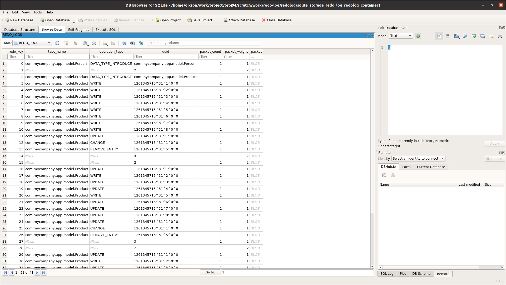

# xap-persist-training - lab08-redolog

## Lab Goals

 * Configure Redolog, explore Redolog content when configured with SQLite, flush memory portion to disk, replay redolog.

## Lab Description

 * During this lab you will deploy a space that's configured for a mirror, without actually deploying one, to generate a redolog. We will run Writer to write data into the space.
 * We will use a distributed task to flush the redolog data onto the disk.
 * We will use a ProcessRedoLog to read data from SQLite and replay it.
 * We will use a SQLite Browser to view redolog Data.
 * This example uses a space with one partition. For multiple partitions you should run ProcessRedoLog per each redolog file on all machines.
 * The flush step will be done automatically in undeploy or shutdown, starting from version 16.4:
     * When setting `com.gs.redolog.flush.on.shutdown` to true, the redolog file will be copied to `$GS_HOME/work/redolog-backup`.
     * You can get notification about it by implementing `com.gigaspaces.utils.RedologFlushNotifier` and setting `com.gs.redolog.flush.notify.class` with the related class name, and placing the jar containing it under `$GS_HOME/platform/ext`.
     * You should also increase the shutdown hook timeout to allow time for the above process, by setting `com.gs.shutdownhook.timeout` (unit is seconds).

## Generate a Redolog

1. Start a grid with 2 GSC `./gs.sh host run-agent --auto --gsc=2`
2. Have a look at CustomSpaceConfig in my-app-space module. Verify the configuration is clear
3. Deploy my-app-space (1 partition with ha) `./gs.sh pu deploy --partitions=1 --ha my-app-space-pu $PROJ_DIR/my-app-space/target/my-app-space-1.0-SNAPSHOT.jar`
4. Have a look at Writer in the redolog-client module.
5. Run Writer
6. Check the redolog size and space data using ui-tool (One way to do this is to export query results).
   Via the CLI, `./gs.sh space info --type-stats my-app-space-pu` shows the space's object counts; the
   redolog itself is the pending-replication backlog, so `./gs.sh space info-instance --replication-stats <instance ID>`
   (get instance IDs with `./gs.sh space list-instances my-app-space-pu`) is the closest CLI equivalent
   for its size, though this hasn't been confirmed against a live run - check its actual output before
   relying on a specific field name.

## Flush the Redolog to Disk

1. Have a look at FlushRedoLogToDisk in redolog-client module. Verify you understand the flow.
2. Run FlushRedoLogToDisk
3. Install SQLite browser https://sqlitebrowser.org/dl/
4. Open SQLite browser with file: `$GS_HOME/work/redo-log/redolog/sqlite_storage_redo_log_redolog_container1` (redolog is name of the space)

   

   Note: the contents of the SQLite database are in serialized format that the redo log understands and are not the actual objects.
5. Copy files under `$GS_HOME/work/redo-log/redolog` to a backup location, e.g. `$HOME/backup/work/redo-log/redolog`

## Replay the Redolog

1. Shutdown the grid
2. Start the grid again: `./gs.sh host run-agent --auto --gsc=2`
3. Deploy my-app-space (1 partition with ha). See all is empty as expected.
4. Run ProcessRedoLog to write all data back to space, pointing it to `$GS_HOME`, which is the backup location, by setting the VM arg, e.g. `-Dcom.gs.home="$HOME/backup"`, and the relevant space and container names as program arguments, e.g. `redolog redolog_container1`
5. Compare space data with original data
