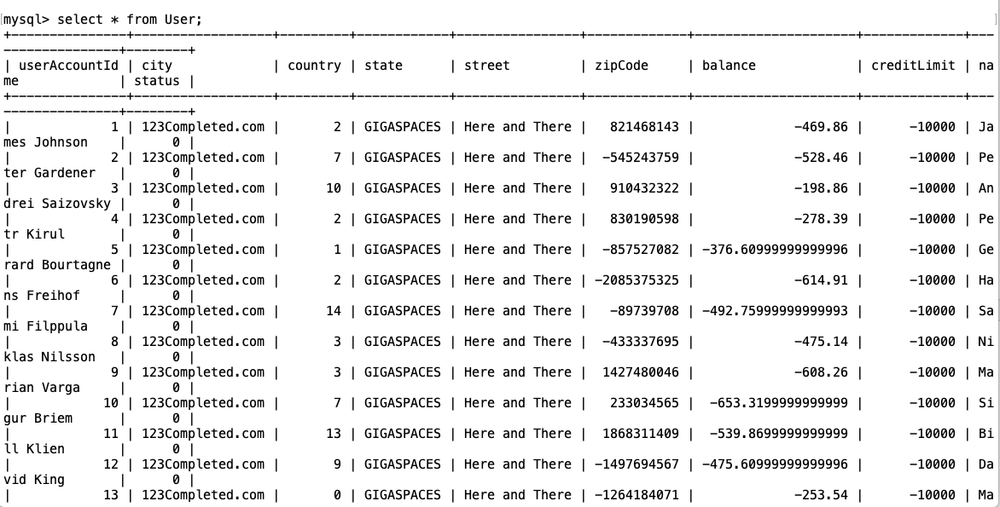
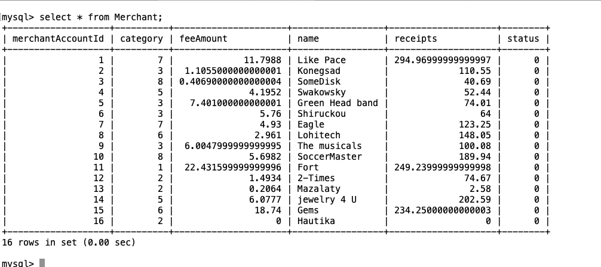
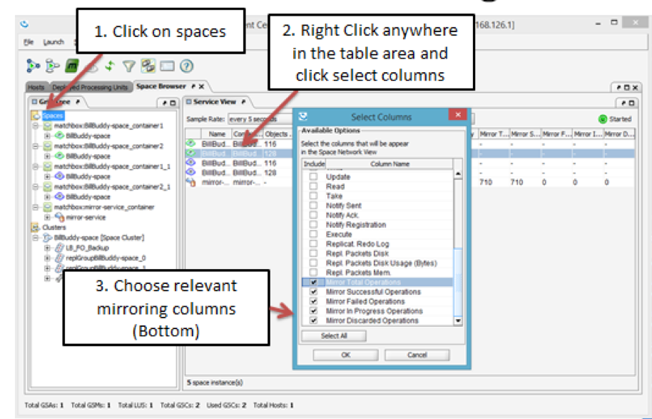

# Lab4-exercise - Persistency - The Mirror Service 

## Lab Goals

1. Understand the tasks involved in implementing a mirror service. <br />
2. implement a mirror service. <br />

## Lab Description
This lab includes 1 exercise in which we will perform the tasks required to implement a mirror service. 	
Use the slides from the lesson as a reference.

## 1 Lab setup	
Make sure you restart gs-agent and gs-ui (or at least undeploy all Processing Units using gs-ui)

**1.1** Open %XAP_TRAINING_HOME%/xap-dev-training-lab4-exercise project with intellij (open pom.xml)
**1.2** Run mvn install

    [INFO] ------------------------------------------------------------------------
    [INFO] Reactor Summary:
    [INFO] 
    [INFO] lab4-exercise ...................................... SUCCESS [  0.162 s]
    [INFO] BillBuddyModel ..................................... SUCCESS [  0.811 s]
    [INFO] BillBuddy_Space .................................... SUCCESS [  0.177 s]
    [INFO] BillBuddyAccountFeeder ............................. SUCCESS [  0.196 s]
    [INFO] BillBuddyPaymentFeeder ............................. SUCCESS [  0.176 s]
    [INFO] BillBuddyPersistency ............................... SUCCESS [  0.718 s]
    [INFO] ------------------------------------------------------------------------
    [INFO] BUILD SUCCESS
    
**1.3**   Run mvn xap:intellij <br />
##### This will add the predefined Run Configuration Application to your Intellij IDE.

    [INFO] ------------------------------------------------------------------------
    [INFO] Reactor Summary:
    [INFO] 
    [INFO] lab4-exercise ...................................... SUCCESS [  0.400 s]
    [INFO] BillBuddyModel ..................................... SKIPPED
    [INFO] BillBuddy_Space .................................... SKIPPED
    [INFO] BillBuddyAccountFeeder ............................. SKIPPED
    [INFO] BillBuddyPaymentFeeder ............................. SKIPPED
    [INFO] BillBuddyPersistency ............................... SKIPPED
    [INFO] ------------------------------------------------------------------------
    [INFO] BUILD SUCCESS

#### Notice the following 5 modules in Intellij: ####

##### BillBuddy-Space #####
Contains a processing Unit with embedded space and business logic <br />

##### BillBuddyModel #####
Defines all declarations that are required, in space side as well as the client application side.
This project should be deployed with all other projects since all other projects are dependent on the model. <br />

##### BillBuddyAccountFeeder #####
A client application (PU) that will be executed in Eclipse. This application is responsible for writing Users and Merchants to the space. <br />

##### BillBuddyPaymentFeeder #####
A client application that simulates an initial payment process. It creates a payment every second. <br />

##### BillBuddyPersistency #####
The data source configuration
    
## 2	Persistency – Mirror Service Implementation

**2.1**   Setup MySQL DB for this lesson.

##### Windows	
	
1.	Go to https://dev.mysql.com/downloads/mysql and download available GA MySQL Community Server.<br /> 	
2.  Extract it to: c:\mysql <br />	
3.	Make sure you shut down any prior existing mysqls in your system. <br />	
4.	Open a command window <br />	
5.	Navigate c:\mysql\bin: <br /> 	

     cd C:\mysql\mysql-5.5.48-winx64\bin	

6.	Run MySQL server: 	

     mysqld --console	


##### Linux

1. Download MySQL <br />

    yum install mysql-server (or sudo apt-get install mysql-server)
          	
2.	Run MySQL server <br />	

     /sbin/service mysqld start (or sudo service mysql start)


##### Mac	
	
1.  Download MySQL from: https://dev.mysql.com/downloads/mysql/ <br/>
2.  Open MySQL package installer, which is provided on a disk image (.dmg) that includes the main MySQL installation package file.<br>	
	Double-click the disk image to open it <br />	
3.	Start MySQL service (if you wish to stop or restart run the same command with stop or restart at the end)<br />	
	
    sudo /usr/local/mysql/support-files/mysql.server start
    
    output:
    Starting MySQL
        .. SUCCESS! 


**2.1** Database configuration and setup

1. Run the secure installation (below command gives option set to root password)
```
    mysql_secure_installation
    # Suggested password 'Giga1234$'
    # Mac and Linux users don't forget to use sudo
```
2. Create database and user
	1. Create the database. In a terminal window,  
	   mysqladmin --user=root create jbillbuddy (located in /usr/bin)
	2. Create user and privileges
```
       mysql -u root -p
       # Mac and Linux users, don't forget to use sudo
       # In mysql session
       CREATE USER 'jbillbuddy'@'%' IDENTIFIED BY 'Giga1234$';
       GRANT ALL PRIVILEGES ON jbillbuddy.* TO 'jbillbuddy'@'%';

       # Verify
       SELECT user,host FROM mysql.user; SHOW GRANTS for jbillbuddy;
       exit

       # Optionally, check if you can login with the new user
       mysql -u jbillbuddy -p
```
3. Validate that your instance has been created:
	1.  Open terminal
	2.  Run: mysql jbillbuddy -u root -p
	3.  Run: show tables;
	4.  Verify no tables exist.

## 3  Configure the BillBuddy_Space and mirror service
**3.1**   Configure your space to be mirror service aware. <br />.	
1. Modify your embedded Space pu.xml. mirrored="true" space element tag (Hint: BillBuddy_space pu.xml) <br />	

**3.2**   Map the data model to tables (using Hibernate. we will use annotations.) <br />	
1.	Search the data model to see which POJOs were chosen for persistency for our demo <br />	
2.	Examine specifically the User and Address relationship and try to figure out the meaning of the hibernate annotations. <br />	

**3.3**	Configure the mirror service. <br />	
The mirror service requires having to be configured appropriately. 	
The lab is already configured correctly for you. 	
Your task is to locate the file in which the configuration is defined.	
Basically you should be able to answer the following questions prior to configuring the environment. <br /> 	
1.	What space am I Mirroring? <br />	
##### Answer: BillBuddy-space <br />	
2.	Which POJOs am I to persist? <br />	
##### Answer: In this lab we will persist: User, Merchant, Payment, ProcessingFee and Contract	
Package Name: com.c123.billbuddy.model <br />	
3.	What is the database (in most cases) that I am persisting to? <br /> 	
##### Answer: we will use MySQL DB for demo purposes. <br />			
4.	What are the DB user name, DB password, JDBC URL and JDBC Driver? <br />	
##### Answer: 	

   	

**3.4**  The following tasks will make it clearer how to implement a Mirror service. <br />	
Hint: Use slides from the lesson as a reference. Most tasks are already implemented. <br />	
1. Expand BillBuddyPersistency module and open the pu.xml file. <br />	
2. Locate the data source bean (DB Connection properties). 	
Write down the user and the password for the MySQL DB database 	
(You will use it later). <br />	
3. Specify Space Components to be mapped using package scanning. 	

Configure Spring to locate your hibernate annotated classes. <br />	
1. Fill in the package to be scanned where your persistent POJOs are located 	
(Search the POJOs in the model that were annotated with @Entity and write their full name in the SessionFactory bean). <br />	
`<property name="packagesToScan" value="com.c123.billbuddy.model" />`
2. Hint: 4 classes only for this demo (but all in same package)	
Specify the mirror to recognize the mirror space (This step is already implemented)	
3. Complete the os-core:mirroros-core:source-space	
4. Use slides from the lesson as a reference. <br />	

**3.5**   Make sure you have a Database ready for use.	
We will using MySQL db instance. <br />	
1.	Make sure you have the MySQL instance up and running.

## 4  Deploy the BillBuddy_Space and mirror service

**4.1**	Run gs-agent (./gs.sh host run-agent --auto --gsc=5) <br />
**4.2**	Run gs-ui <br />	
**4.3**	Deploy BillBuddy_space to the service grid. <br />	

    cd $XAP_HOME/bin
    ./gs.sh pu deploy BillBuddy-Space ~/xap-persist-training/xap-persist-training-lab4-exercise/BillBuddy_Space/target/BillBuddy_Space.jar 
    
    [BillBuddy_Space.jar] successfully uploaded
    ····
    Instance [BillBuddy-Space~2_1] successfully deployed
    Instance [BillBuddy-Space~1_1] successfully deployed
    ·
    Instance [BillBuddy-Space~1_2] successfully deployed
    ·
    Instance [BillBuddy-Space~2_2] successfully deployed
    
    Processing Unit [BillBuddy-Space] was successfully deployed at 2020-03-22 16:45:28


**4.4**	Deploy BillBuddPersistency to the service grid: <br />	

    ./gs.sh pu deploy BillBuddyPersistency ~/xap-persist-training/xap-persist-training-lab4-exercise/BillBuddyPersistency/target/BillBuddyPersistency.jar 
    
    [BillBuddyPersistency.jar] successfully uploaded
    ··
    Instance [BillBuddyPersistency~1] successfully deployed
    
    Processing Unit [BillBuddyPersistency] was successfully deployed at 2020-03-22 17:01:24
    
**4.5**	Validate Mirror service deployed using gs-ui <br />	

 	


**4.6**  Use the gs-ui to locate the GSC which contain the deployed mirror service. <br /> 
Check the GSC log and validate successful deployment. <br />	
Search for the following message for both of the primary spaces instances:

    2020-03-22 17:01:22,804 BillBuddyPersistency [1] INFO [com.gigaspaces.replication.channel.in.BillBuddy-space2.primary-backup-reliable-async-mirror-2.mirror-service] - Channel established
    2020-03-22 17:01:22,852 BillBuddyPersistency [1] INFO [com.gigaspaces.replication.channel.in.BillBuddy-space1.primary-backup-reliable-async-mirror-1.mirror-service] - Channel established
    


**4.7** From the Intellij run configuration select BillBuddyAccountFeeder and run it <br />
**4.8** From the Intellij run configuration select BillBuddyPaymentFeeder and run it <br />

**4.9** Run some queries in MySQL





**4.10** Monitoring the Mirror service



**4.11**	 Compare the number of mirror total operations against the overall number of POJOs you have.<br>
Count only POJOs you persist. <br />
Can you explain why there are many more mirror operations than POJOs?