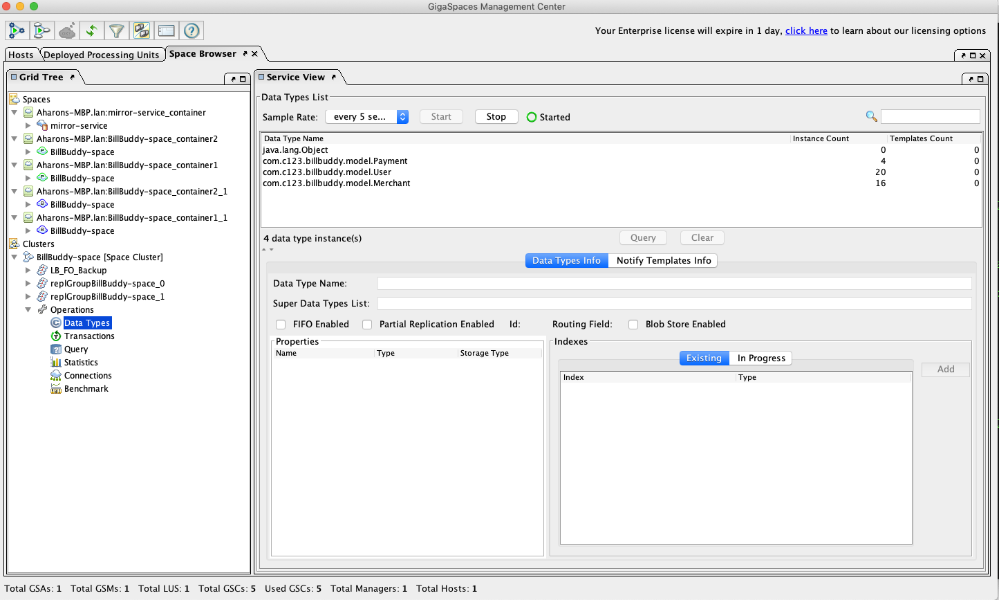
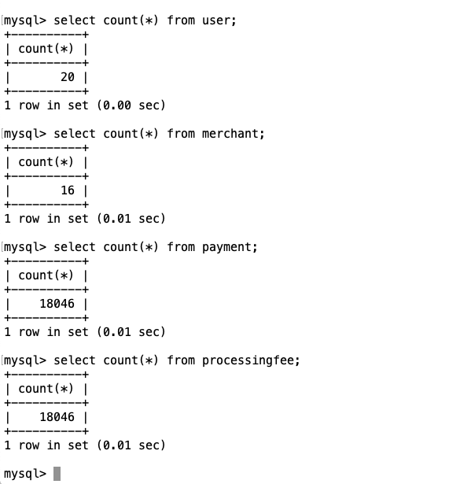

# Lab5-solution - Initial Load - Space Classes 

## Lab Goals

Implement and configure Initial Load for Space Classes.  

## Lab Description
During this lab you will deploy Bill Buddy Application & load initial data into the space from MySQL database.  
The MySQL data was populated as part of Lab #4 and will upload this data as part of the initial load from the database.  
In the first exercise (2) you will configure initial load of the entire information from database to the space.  
In the second exercise (3) you will configure a custom initial load to load partial data into the space based on
the custom load query

## 1 Lab setup	
Make sure you restart gs-agent and gs-ui (or at least undeploy all Processing Units using gs-ui)

**1.1** Open %XAP_TRAINING_HOME%/xap-dev-training-lab5-solution project with intellij (open pom.xml) 
**1.2** Run `mvn install`

    [INFO] ------------------------------------------------------------------------
    [INFO] Reactor Summary:
    [INFO] 
    [INFO] lab5-solution ...................................... SUCCESS [  0.226 s]
    [INFO] BillBuddyModel ..................................... SUCCESS [  2.071 s]
    [INFO] BillBuddy_Space .................................... SUCCESS [  1.590 s]
    [INFO] BillBuddyAccountFeeder ............................. SUCCESS [  0.709 s]
    [INFO] BillBuddyPaymentFeeder ............................. SUCCESS [  0.545 s]
    [INFO] BillBuddyPersistency ............................... SUCCESS [  1.218 s]
    [INFO] BillBuddy_SpaceCustomInitialLoad ................... SUCCESS [  0.523 s]
    [INFO] ------------------------------------------------------------------------
    [INFO] BUILD SUCCESS

    
**1.3**   Run mvn `xap:intellij`  
##### This will add the predefined Run Configuration Application to your Intellij IDE.

    [INFO] Reactor Summary:
    [INFO] 
    [INFO] lab5-solution ...................................... SUCCESS [  0.422 s]
    [INFO] BillBuddyModel ..................................... SKIPPED
    [INFO] BillBuddy_Space .................................... SKIPPED
    [INFO] BillBuddyAccountFeeder ............................. SKIPPED
    [INFO] BillBuddyPaymentFeeder ............................. SKIPPED
    [INFO] BillBuddyPersistency ............................... SKIPPED
    [INFO] BillBuddy_SpaceCustomInitialLoad ................... SKIPPED
    [INFO] ------------------------------------------------------------------------
    [INFO] BUILD SUCCESS

#### Notice the following 5 modules in Intellij: ####

##### BillBuddy-Space #####
Contains a processing Unit with embedded space and business logic  

##### BillBuddyModel #####
Defines all declarations that are required, in space side as well as the client application side.
This project should be deployed with all other projects since all other projects are dependent on the model.  

##### BillBuddyAccountFeeder #####
A client application (PU) that will be executed in Eclipse. This application is responsible for writing Users and Merchants to the space.  

##### BillBuddyPaymentFeeder #####
A client application that simulates an initial payment process. It creates a payment every second.  

##### BillBuddyPersistency #####
The data source configuration
       
## 2	Implement Basic Initial Load

**2.1** Open project BillBuddy_Space  
**2.2** Edit PU.xml 
a. Space definition (Fix the TODO)  
b. Define the space-data-source to be hibernateSpaceDataSource bean   
c. Define the <os-core:properties> add properties to define initial load parameters (Tip: check out the presentation slides)
*   i. space-config.engine.cache_policy  
*   ii. space-config.external-data-source.usage  
*   iii. cluster-config.cache-loader.external-data-source  
*   iv. cluster-config.cache-loader.central-data-source  

**2.3** Test Initial Load  
a. Make sure the Mysql database service is up and running. If you don't know how, refer to lab 4  
b. Run gs-agent: 
    `./gs.sh host run-agent --auto --gsc=4` 
c. Run gs-ui  
d. Deploy BillBuddy_space to the service grid: 
    `./gs.sh pu deploy BillBuddy-Space ~/xap-persist-training/xap-persist-training-lab5-solution/BillBuddy_Space/target/BillBuddy_Space.jar`  
e. From the Intellij run configuration select BillBuddyAccountFeeder and run it  
f. From the Intellij run configuration select BillBuddyPaymentFeeder and run it  
g .Check that space load Users, Merchants, Payments, Processing Fee  

   	
   
h. Execute SQL statement & count that all object have been loaded into the space  
**1.** Connect to MySQL database (as described in lesson #4)  
**2.** Connect to mysql instance:  
   ##### Windows
   mysql -u root -p jbillbuddy   
   ##### Linux
   /usr/bin/mysql jbillbuddy  -u root –p   
   ##### Mac
   cd /usr/local/mysql/bin ./mysql jbillbuddy -u root (no password is required).  
    
**3.** Run “select count(*) from user;”  
**4.** Run “select count(*) from merchant;”  
**5.** Run “select count(*) from payment;”  
**6.** Run “select count(*) from processingfee;”  
**7.** Make sure you see the results  

   

**8.** Stop GS-Agent & Gs-ui

## 3 Implement Custom Initial Load Queries

**3.1** Edit Payment space class (in BillBuddyModel project)  
a. Add custom load method to Paymet class (FIX TODO) 
1. public String initialLoadQuery()  
2. Annotate this method with proper @SpaceInitialLoadQuery  
3. Method returns string of the where query to specify the custom loading criteria.  
4. Specify a criteria that return only payment that are greater than 50.  
  
**3.2** Edit PU.xml (of BillBuddy_SpaceCustomInitialLoad project)  
a. Hibernate Space Data Source definition (Fix the TODO)  
1. Fix hibernateSpaceDataSource bean  
2. Add new property initialLoadQueryScanningBasePackages that enables scanning of
  packages that enable custom initial loading. 
  Fill in the list with one entry “com.c123.billbuddy.model” in order to scan the change we have made to payments.
  
## 4 Test Initial Load
 
a. Make sure the Mysql database service is up and running.  
b. Run gs-agent (restart if one is already running)  
c. Run gs-ui (restart if one is already running)  
d. Deploy BillBuddy_ SpaceCustomInitialLoad to the service grid  

    ./gs.sh pu deploy BillBuddy_SpaceCustomInitialLoad ~/XAPPersistTraining/labs/lab5-solution/xap-persist-training/BillBuddy_SpaceCustomInitialLoad/target/BillBuddy_SpaceCustomInitialLoad.jar

e. Check that space load Users, Merchants, Payments, Processing Fee

   
   
f.	Run Payment query on the space to make sure only partial payments were load (only those greater than 50)  
g.	Check that the payment are routed between the 2 partitions.  
h.	Execute SQL statement & count that all object have been loaded into the space.  
1. Connect to MySQL database (as described in lesson #4)  
2. Connect to mysql instance:  
   ##### Windows
   mysql -u root -p jbillbuddy   
   ##### Linux
   /usr/bin/mysql jbillbuddy  -u root –p   
   ##### Mac
   cd /usr/local/mysql/bin ./mysql jbillbuddy -u root (no password is required).  

i.	Run “select count (*) from payment;”  
j.	Check out how many records were left out.  
k.	Make sure you see the results.  

