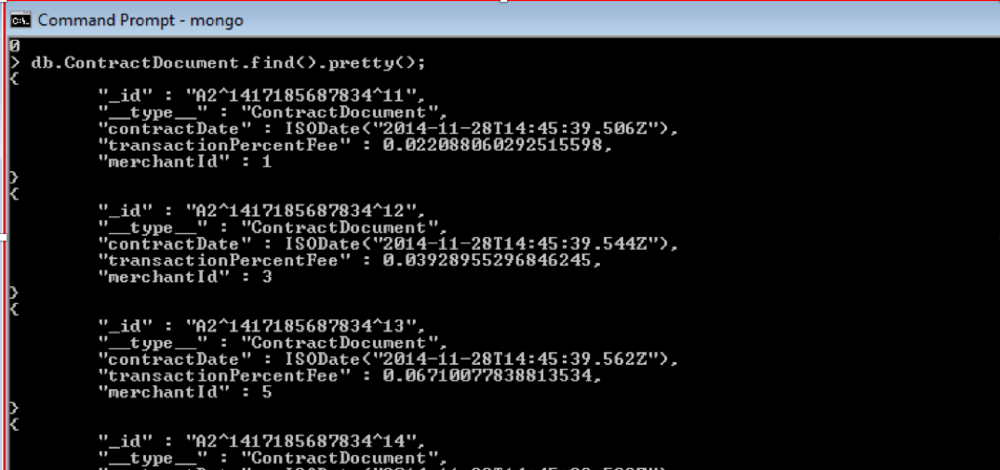
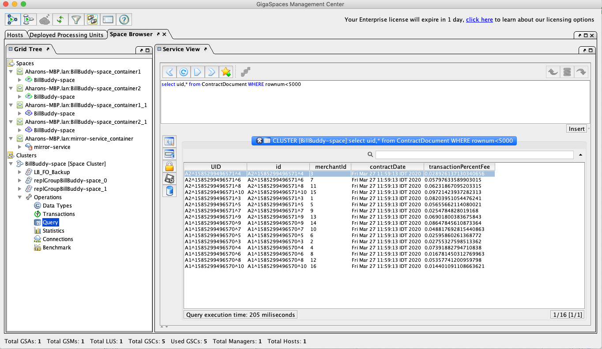

# lab6-exercise - NOSQL Space Document Persistency 

## Lab Goals

Implement and configure persistency for Space Document using Mongo DB. <br />


## Lab Description
1. During this lab you will deploy Bill Buddy Application & examine Mongo DB database to examine that space document (Contract) are being persistent. <br />
2. After Persisting you will test initial load to validate those persistent Space Documents are upload into the space during space deployment in the initial load process. <br />  


## 1 Lab setup
In our Lab we will install Mongo DB and use the console to create DB and query information. <br />
	
Make sure you restart gs-agent and gs-ui (or at least undeploy all Processing Units using gs-ui)
    
**1.1** Open %XAP_TRAINING_HOME%/xap-dev-training-lab6-exercise project with intellij (open pom.xml)<br>
**1.2** Run `mvn package`

    [INFO] ------------------------------------------------------------------------
    [INFO] Reactor Summary:
    [INFO] 
    [INFO] lab6-exercise ...................................... SUCCESS [  0.239 s]
    [INFO] BillBuddyModel ..................................... SUCCESS [  2.050 s]
    [INFO] BillBuddy_Space .................................... SUCCESS [  2.328 s]
    [INFO] BillBuddyAccountFeeder ............................. SUCCESS [  0.662 s]
    [INFO] BillBuddyPaymentFeeder ............................. SUCCESS [  0.537 s]
    [INFO] BillBuddyPersistency ............................... SUCCESS [  1.623 s]
    [INFO] ------------------------------------------------------------------------
    [INFO] BUILD SUCCESS

    
**1.3** Copy the runConfigurations directory to the `.idea` project directory.

##### This will add the predefined applications to your Intellij IDE. The runConfigurations will be used in a later step to run components from the IDE.

Restart Intellij

#### Notice the following 5 modules in Intellij: ####

##### BillBuddy-Space #####
Contains a processing Unit with embedded space and business logic <br />

##### BillBuddyModel #####
Defines all declarations that are required, in space side as well as the client application side.
This project should be deployed with all other projects since all other projects are dependent on the model. <br />

##### BillBuddyAccountFeeder #####
A client application (PU) that will be executed in Intellij. This application is responsible for writing Users and Merchants to the space. <br />

##### BillBuddyPaymentFeeder #####
A client application that simulates an initial payment process. It creates a payment every second. <br />

##### BillBuddyPersistency #####
The data source configuration
       
## 2	Mongo Installation
  
**2.1** Shutdown/kill all XAP and MYSQL processes. <br />
     
**2.2** [Download MongoDB Community Edition](https://www.mongodb.com/download-center/community)

**2.3** [Download MongoDB Shell](https://www.mongodb.com/try/download/shell)

**2.4** [Follow MongoDB Community installation instructions](https://docs.mongodb.com/manual/administration/install-community)

Note: Run `mongod` if you don't intend to install the service. The data files are written to `C:/data/db`.

## 3  Configure Projects To Mongo Persistency 
**3.1** Configure BillBuddy Space to initial load from mongo <br />

##### 	Edit pu.xml <br />
Configure “mongoClient” <br />
 i.	Fix TODO <br />
 1.	Database name in the “db” property should be mnbillbuddy <br />
 2.	com.mongodb.MongoClient constructor arguments <br />
 a.	server name (as the string value), use localhost for our lab <br /> 
 b.	port number (as the int value), the default mongo db port number is 27017 <br />
 c.	Configure spaceDataSource <br />
 i.	FIX TODO <br />
  1.	Configure property mongoClientConnector to the mongoClient bean <br />
  	    Configure BillBuddy-space to work with initial load <br />
    i.	FIX TODO <br />
  1.	Configure data source defined in section (c) <br />

**3.2** Configure BillBuddy Persistency to persist Contract Document to mongo <br />

##### 	Edit pu.xml <br />
Configure “mongoClient” <br />
  i.	Fix TODO <br />
  1.	Database name in the “db” property: mnbillbuddy <br />
  2.    com.mongodb.MongoClient constructor agruments <br />
    a.	server name (as the string value), use localhost for our lab <br />
    b.	port number (as the int value), the default mongo db port number is 27017 <br />
    c.	Configure spaceSynchronizationEndpoint <br />
    i.	FIX TODO <br />
  3.	Configure property mongoClientConnector to the mongoClient <br />
  	    Configure BillBuddyPersistency (the mirror-service) to work with mongo DB <br />
    i.	FIX TODO <br />
  4.	Configure space-sync-endpoint defined in section (c) <br />

## 4  Test Solution
4.1	Testing instructions <br />
  **a.**	Make sure the Mongo database is up and running. <br />
    
  **b.**	Start the service grid <br />

```
    ./gs.sh host run-agent --auto --gsc=5
```    

  **c.**	run gs-ui <br />

```
    ./gs-ui.sh
```    

  **d.**	deploy BillBuddy_space to the service grid  <br />

```
    ./gs.sh pu deploy BillBuddy-Space $TRAINING_HOME/xap-persist-training-lab6-exercise/BillBuddy_Space/target/BillBuddy_Space.jar
```    

  **e.**	deploy BillBuddyPersistency to the service grid  <br />

```
    ./gs.sh pu deploy BillBuddyPersistency $TRAINING_HOME/xap-persist-training-lab6-exercise/BillBuddyPersistency/target/BillBuddyPersistency.jar
```
    
  **f.**	From the Intellij run configuration select BillBuddyAccountFeeder and run it. <br />
    The account feeder will create only Contract documents for this example <br />
  **g.**	Validate that contract were written into Mongo database <br />
    Connect to Mongo DB database <br />
    
*   Run command: mongo <br />   
    https://docs.mongodb.com/manual/mongo/ 

    ./mongo (or ./mongosh)

*   Write command “use mnbillbuddy” <br />

    > use mnbillbuddy
    switched to db mnbillbuddy
    > 

*   Type “show collections” – this will display all object type stored in Mongo, similar to show tables. <br />

    > show collections
    
*   Run “db.ContractDocument.find().pretty();” <br />

    > db.ContractDocument.find().pretty();
    
*   See that you get records for Contract documents <br />

    > db.ContractDocument.remove({})
    
*   If you want to remove the records for re-running the test.

 
 
 **h.**	Undeploy BillBuddyPersistency <br />
 **i.**	Undeploy BillBuddySpace <br />
 **j.**	Stop the service grid `./gs.sh host kill-agent` <br />
 **k.**	Start the service grid <br />
 **l.**	Deploy BillBuddySpace <br />
 **m.**	Check that you got 16 object for ContractDocument (that were loaded in the Initial load process) <br />

 
