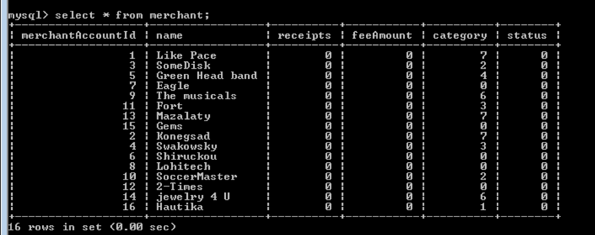
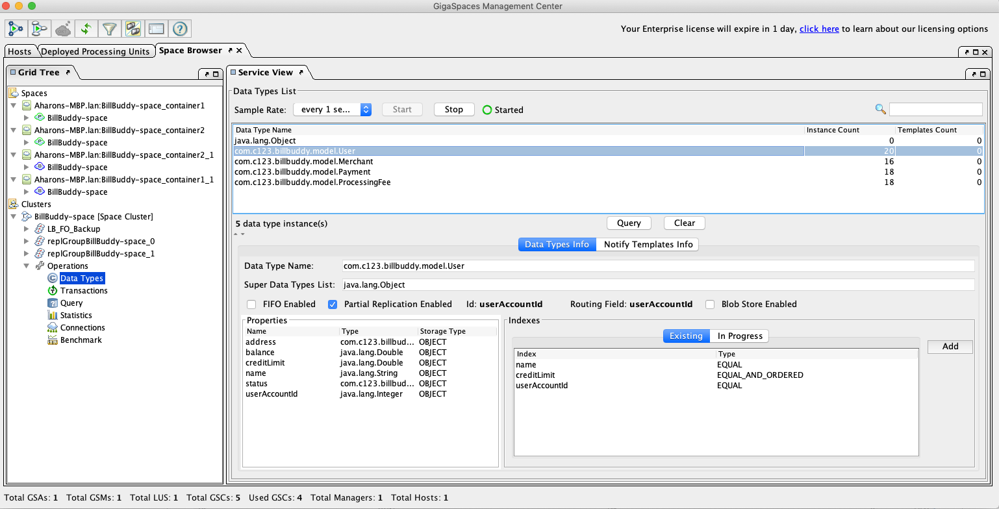

# lab7-exercise - Custom Persistency 

## Lab Goals

•	Implement and configure persistency for Space class using custom persistency implementation.  

## Lab Description
•	During this lab you will deploy Bill Buddy Application & persist data from the space to a relational database using custom persistency hook implementation.    
•	We will utilize standard JDBC calls instead of hibernate.  
•	The lab already include implemented DAO with all JDBC code in it. You are only required to modify the relevant XAP files and pu.xml  
•	You can use this demo as a reference for any other implementation you require.
•	Once Persisting space class to the database you will configure initial load to load space class previously stored the relational database.   

## Lab setup	
Make sure you restart gs-agent and gs-ui (or at least undeploy all Processing Units using gs-ui)  
##### In our Lab we will cover
a.	Creation of database instance in MySQL database.  
b.	Configuration of the space & mirror service to use custom made persistency for persisting space classes & loading them in initial load via JDBC (not using Hibernate).  
c.	Implement a set of classes to support custom persistency.  

    
## 1	Build the project lab

**1.1** Open %XAP_TRAINING_HOME%/xap-dev-training-lab7-exercise project with intellij (open pom.xml) 
**1.2** Run `mvn install`

    [INFO] ------------------------------------------------------------------------
    [INFO] Reactor Summary:
    [INFO] 
    [INFO] lab7-exercise ...................................... SUCCESS [  0.171 s]
    [INFO] BillBuddyModel ..................................... SUCCESS [  0.907 s]
    [INFO] BillBuddy_Space .................................... SUCCESS [  0.903 s]
    [INFO] BillBuddyAccountFeeder ............................. SUCCESS [  0.233 s]
    [INFO] BillBuddyPaymentFeeder ............................. SUCCESS [  0.205 s]
    [INFO] BillBuddyPersistency ............................... SUCCESS [  0.704 s]
    [INFO] ------------------------------------------------------------------------
    [INFO] BUILD SUCCESS

    
**1.3**   Run `mvn xap:intellij`  
##### This will add the predefined Run Configuration Application to your Intellij IDE.

    [INFO] ------------------------------------------------------------------------
    [INFO] Reactor Summary:
    [INFO] 
    [INFO] lab7-exercise ...................................... SUCCESS [  0.421 s]
    [INFO] BillBuddyModel ..................................... SKIPPED
    [INFO] BillBuddy_Space .................................... SKIPPED
    [INFO] BillBuddyAccountFeeder ............................. SKIPPED
    [INFO] BillBuddyPaymentFeeder ............................. SKIPPED
    [INFO] BillBuddyPersistency ............................... SKIPPED
    [INFO] ------------------------------------------------------------------------
    [INFO] BUILD SUCCESS

#### Notice the following 5 modules in Intellij: ####

##### BillBuddy-Space #####
Contains a processing Unit with embedded space and business logic  

##### BillBuddyModel #####
Defines all declarations that are required, in space side as well as the client application side.
This project should be deployed with all other projects since all other projects are dependent on the model.  

##### BillBuddyAccountFeeder #####
A client application (PU) that will be executed in Eclipse. This application is responsible for writing Users and Merchants to the space.  

##### BillBuddyPaymentFeeder #####
A client application that simulates an initial payment process. It creates a payment every second.  

##### BillBuddyPersistency #####
The data persistent configuration       

## 2	Database setup

2.1   Setup MySQL DB for this lesson.
      Please follow the inductions as appear in section 2.1 readme of lab4.
    	
a.  Create BillBuddy database  

    cd /usr/local/mysql/bin	
    ./mysqladmin --user=root create custbillbuddy	

b.	Validate that your instance has been created  	    

    cd /usr/local/mysql/bin	
    ./mysql custbillbuddy -u root (no password is required)
    
    output:
    Welcome to the MySQL monitor.  Commands end with ; or \g.
    Your MySQL connection id is 2
    Server version: 5.5.49 MySQL Community Server (GPL)
    
    Copyright (c) 2000, 2016, Oracle and/or its affiliates. All rights reserved.
    
    Oracle is a registered trademark of Oracle Corporation and/or its
    affiliates. Other names may be trademarks of their respective
    owners.
    
    Type 'help;' or '\h' for help. Type '\c' to clear the current input statement.
    
    mysql> 

    
c. Verify no tables exist  
	
    show tables;
    
    output:
    Empty set (0.00 sec)
    
  
## 3	Mirror Service Configuration and Setup
3.1	Open BillBuddyPersistency project   

**a.**  Implement BillBuddySpaceSynchronizationEndpoint  
* a.  FIX the TODO  
* b.  onOperationsBatchSynchronization()
you are required to store all objects that are taking part in a transaction.  
We have provided you a storeObject(Object obj) that is a part of the class.  
   * i.	Examine the storeObject(Object obj) method. 
            The method is utilizing an already implemented native DAO layer that deals with all JDBC commands. 
            Feel free to examine the DAO code as well.  
   * ii.	Fix missing implementation the method gets as an input a list of objects.  
   * iii.	Store each of those object using private method storeObject(Object obj)   
   
**b.**	Edit PU.xml
  * a.	FIX TODO  
  * b.	Add spring scanning for the package where the SpaceSynchronizationEndpoint exists.   
  * c.	Add definition for the supported space classes as part of the custom  SpaceSynchronizationEndpoint (bean supportedManageSpaceClasses).  
  * d.	For bean billBuddySpaceSynchronizationEndpoint fix:   
    * i.	property datasource to point to the database data source.  
    * ii.	Class name for the SpaceSynchronizationEndpoint.  
  * e.	For os-core:mirror fix property space-sync-endpoint to reference the custom SpaceSynchronizationEndpoint (bean billBuddySpaceSynchronizationEndpoint).  

## 4	Space Configuration For Initial Load
4.1	Open BillBuddy_Space project   

**a.**	Implement BillBuddySpaceDataSource  
* a.	This class will be used to load data from the database  
* b.	FIX the TODO  
* c.	Method initialDataLoad  
  * i.	Fix missing implementation of the method gets as an input a list of objects.  
  * ii.	Load all object from the database using the different DAO object (method readFromDB() ).  
        Hint see check private member to see what DAO are available to you.  
        
**b.**	Implement CustomDataIterator (No code changes are required. Review code).  
* a.	This class is used to return the results. No fix is required, but you can review the simple implementation.   

**c.**	Implement BillBuddyCustomFactoryBean
* a.	This class will be used as a factory to create the custom space data source.  
* b.	FIX the “TODO”s
* c.	Method getObject()
   * i.	Fix missing implementation of creating initiating the private member billBuddySpaceDataSource
* d.	Method getObjectType()
   * i.	Fix missing implementation, return BillBuddySpaceDataSource.class
   
**d.**	Edit PU.xml
* a.	FIX TODO
* b.	Add spring scanning the for the package that hold the definition of BillBuddyCustomFactoryBean & BillBuddySpaceDataSource exists.   
* c.	Add definition for the supported space classes as part of the custom  SpaceDataSource (bean supportedManageSpaceClasses).  
* d.	For bean billBuddySpaceDataSource fix: 
   * i.	property datasource to point to the database data source.  
   * ii.	Class name for the CustomFactoryBean.  
   
**e.**	For os-core:space fix property space-data-source to reference the custom CustomFactoryBean ( bean billBuddySpaceDataSource)

## 5	Test Solution

5.1	Testing Mirror  

a.	Make sure the MySQL database service is up and running.  
b.  Run gs-agent  

    ./gs.sh host run-agent --auto --gsc=5
    
c.  Run gs-ui  
d.  Deploy BillBuddy_space to the service grid:  

    cd $XAP_HOME/bin
    ./gs.sh pu deploy BillBuddy-Space ~/xap-persist-training/xap-persist-training-lab7-exercise/BillBuddy_Space/target/BillBuddy_Space.jar 
    
    [BillBuddy_Space.jar] successfully uploaded
    ····
    Instance [BillBuddy-Space~2_1] successfully deployed
    Instance [BillBuddy-Space~1_1] successfully deployed
    
    Instance [BillBuddy-Space~1_2] successfully deployed
    Instance [BillBuddy-Space~2_2] successfully deployed
    
    Processing Unit [BillBuddy-Space] was successfully deployed at 2020-03-27 14:34:19
    
    
e.	Deploy BillBuddPersistency to the service grid

     ./gs.sh pu deploy BillBuddyPersistency ~/xap-persist-training/xap-persist-training-lab7-exercise/BillBuddyPersistency/target/BillBuddyPersistency.jar 
    
    [BillBuddyPersistency.jar] successfully uploaded
    ·
    Instance [BillBuddyPersistency~1] successfully deployed
    
    Processing Unit [BillBuddyPersistency] was successfully deployed at 2020-03-27 14:41:43
  
f. From the Intellij run configuration select BillBuddyAccountFeeder and run it.  
g. From the Intellij run configuration select BillBuddyPaymentFeeder and run it.          
h. Go to MySQL Relational Database cli 

*   Run the following command in order to connect to the BillBuddy database:  

    `mysql -u root -p custbillbuddy`
    

*	Query The Relational Database:  
  a.	Use the command in order to view your table list.  
        These tables were created by NHibernate mappings.  
 
    show tables; 
    
  b.	Select the content of any table by issuing the following command:   

    select * from merchant;
    
  c.	Validate the results

  
   	
   
      
7.5.2	Testing Initial Load  

a.	Stop Payment feeder  
b.	Kill gs-agent & gs-ui  
c.	Make sure the MySQL database service is up and running.  
d.	Run gs-agent  
e.	Run gs-ui  
f.	Deploy BillBuddy_Space to the service grid.  
g.	Check that space load Users, Merchants, Payments, Processing Fee  

   

h.	Execute SQL statement & count that all object have been loaded into the space:  

  a.	Connect to MySQL database  
  b.	mysql -u root -p custbillbuddy  
  c.	Run “select count(*) from payment;”  