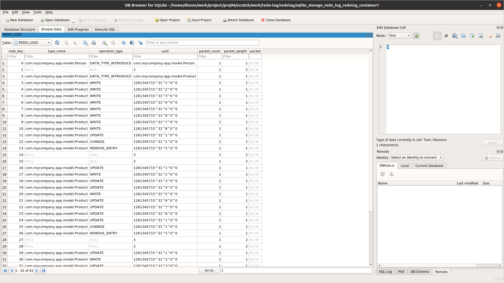

# lab9-solution - Redolog in SQLite

## Lab Goals

 * Configure Redolog, explore Redolog content when configured with SQLite, flush memory portion to disk, replay redolog .  

## Lab Description
 * During this lab you will deploy a space configured with mirror without deploying a mirror to generate a redolog. We will run Writer to write data into the space.
 * We will use a distributed task to flush the redolog data onto the disk.
 * We will use a ProcessRedoLog to read data from SQLite and replay it.
 * We will use a SQLite Browser to view redolog Data.
 * This example demonstrates with a space with one partition. For multiple partitions you should run ProcessRedoLog per each redolog file on all machines.
 * The flush step will be done automatically in undeploy or shutdown **starting from version 16.4** when setting
     com.gs.redolog.flush.on.shutdown to true, redolog file will be copied to gs-home/work/redolog-backup folder
     you can also get notification regarding it by implementing com.gigaspaces.utils.RedologFlushNotifier
     and setting :com.gs.redolog.flush.notify.class with the related class name, and place the jar containing it under gs-home/platform/ext
     you should also increase shutdown hook time out in order to allow time for above process by:
     setting com.gs.shutdownhook.timeout (unit is seconds)

## Lab Setup

1. Start a grid with 2 GSC `./gs.sh host run-agent --auto --gsc=2`
2. Have a look at CustomSpaceConfig in my-app-space module. Verify the configuration is clear
3. Deploy my-app-space (1 partition with ha) `./gs.sh pu deploy --partitions=1 --ha my-app-space-pu $PROJ_DIR/my-app-space/target/my-app-space-1.0-SNAPSHOT.jar`
4. Have a look at Writer in the redolog-client module.
5. Run Writer
6. Check the redolog size and space data using ui-tool (One way to do this is to export query results). 
7. Have a look at FlushRedoLogToDisk in redolog-client module. Verify you understand the flow.
8. Run FlushRedoLogToDisk
9. Install SQLite browser https://sqlitebrowser.org/dl/
10. Open SQLite browser with file: `gs-home/work/redo-log/redolog/sqlite_storage_redo_log_redolog_container1` (redolog is name of the space)

Note: the contents of the SQLite database are in serialized format that the redo log understands and are not the actual objects.
11. Copy files under  gs-home/work/redo-log/redolog to a backup location, e.g. `$HOME/backup/work/redo-log/redolog`
12. Shutdown the grid
13. Start the grid again  `./gs.sh host run-agent --auto --gsc=2`
14. Deploy my-app-space (1 partition with ha). See all is empty as expected.
15. Run ProcessRedoLog to write all data back to space, point it to gs-home which is backup location by setting vm arg, e.g. -Dcom.gs.home="$HOME/backup" and relevant space and container names as program arguments, e.g redolog redolog_container1
16. Compare space data with original data

